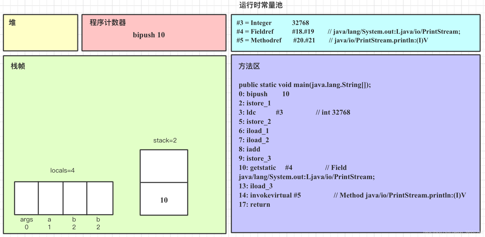

# 类加载与字节码技术

> .java文件编译生成.class文件，需要装载到内存里面执行，装载到内存里面这个事情就是由**类加载器**完成的。

1. 类文件结构
2. 字节码指令
3. 编译期处理
4. 类加载阶段
5. 类加载器
6. 运行期优化

## 1.  类文件结构

一个简单的 HelloWorld.java

```java
// HelloWorld 示例
public class HelloWorld {
public static void main(String[] args) {
System.out.println("hello world");
}
}
```

执行 javac -parameters -d . HellowWorld.java

编译为 HelloWorld.class 后是这个样子的：

> [root@localhost ~]# od -t xC HelloWorld.class
> 0000000 ca fe ba be 00 00 00 34 00 23 0a 00 06 00 15 09
> 0000020 00 16 00 17 08 00 18 0a 00 19 00 1a 07 00 1b 07
> 0000040 00 1c 01 00 06 3c 69 6e 69 74 3e 01 00 03 28 29
> 0000060 56 01 00 04 43 6f 64 65 01 00 0f 4c 69 6e 65 4e
> 0000100 75 6d 62 65 72 54 61 62 6c 65 01 00 12 4c 6f 63
> 0000120 61 6c 56 61 72 69 61 62 6c 65 54 61 62 6c 65 01
> 0000140 00 04 74 68 69 73 01 00 1d 4c 63 6e 2f 69 74 63
> 0000160 61 73 74 2f 6a 76 6d 2f 74 35 2f 48 65 6c 6c 6f
> 0000200 57 6f 72 6c 64 3b 01 00 04 6d 61 69 6e 01 00 16
> 0000220 28 5b 4c 6a 61 76 61 2f 6c 61 6e 67 2f 53 74 72
> 0000240 69 6e 67 3b 29 56 01 00 04 61 72 67 73 01 00 13
> 0000260 5b 4c 6a 61 76 61 2f 6c 61 6e 67 2f 53 74 72 69
> 0000300 6e 67 3b 01 00 10 4d 65 74 68 6f 64 50 61 72 61
> 0000320 6d 65 74 65 72 73 01 00 0a 53 6f 75 72 63 65 46
> 0000340 69 6c 65 01 00 0f 48 65 6c 6c 6f 57 6f 72 6c 64
> 0000360 2e 6a 61 76 61 0c 00 07 00 08 07 00 1d 0c 00 1e
> 0000400 00 1f 01 00 0b 68 65 6c 6c 6f 20 77 6f 72 6c 64
> 0000420 07 00 20 0c 00 21 00 22 01 00 1b 63 6e 2f 69 74
> 0000440 63 61 73 74 2f 6a 76 6d 2f 74 35 2f 48 65 6c 6c
> 0000460 6f 57 6f 72 6c 64 01 00 10 6a 61 76 61 2f 6c 61
> 0000500 6e 67 2f 4f 62 6a 65 63 74 01 00 10 6a 61 76 61
> 0000520 2f 6c 61 6e 67 2f 53 79 73 74 65 6d 01 00 03 6f
> 0000540 75 74 01 00 15 4c 6a 61 76 61 2f 69 6f 2f 50 72
> 0000560 69 6e 74 53 74 72 65 61 6d 3b 01 00 13 6a 61 76
> 0000600 61 2f 69 6f 2f 50 72 69 6e 74 53 74 72 65 61 6d
> 0000620 01 00 07 70 72 69 6e 74 6c 6e 01 00 15 28 4c 6a
> 0000640 61 76 61 2f 6c 61 6e 67 2f 53 74 72 69 6e 67 3b
> 0000660 29 56 00 21 00 05 00 06 00 00 00 00 00 02 00 01
> 0000700 00 07 00 08 00 01 00 09 00 00 00 2f 00 01 00 01
> 0000720 00 00 00 05 2a b7 00 01 b1 00 00 00 02 00 0a 00
> 0000740 00 00 06 00 01 00 00 00 04 00 0b 00 00 00 0c 00
> 0000760 01 00 00 00 05 00 0c 00 0d 00 00 00 09 00 0e 00
> 0001000 0f 00 02 00 09 00 00 00 37 00 02 00 01 00 00 00
> 0001020 09 b2 00 02 12 03 b6 00 04 b1 00 00 00 02 00 0a
> 0001040 00 00 00 0a 00 02 00 00 00 06 00 08 00 07 00 0b
> 0001060 00 00 00 0c 00 01 00 00 00 09 00 10 00 11 00 00
> 0001100 00 12 00 00 00 05 01 00 10 00 00 00 01 00 13 00
> 0001120 00 00 02 00 14

根据 JVM 规范，类文件结构如下

ClassFile {
		u4 magic; //4个字节魔数
		u2 minor_version;//两个字节 小版本
		u2 major_version;//两个字节 主版本
		u2 constant_pool_count;
		cp_info constant_pool[constant_pool_count-1];
		u2 access_flags;
		u2 this_class;
		u2 super_class;
		u2 interfaces_count;
		u2 interfaces[interfaces_count];
		u2 fields_count;
		field_info fields[fields_count];
		u2 methods_count;
		method_info methods[methods_count];
		u2 attributes_count;
		attribute_info attributes[attributes_count];

}

### 1.1 魔数
0~3 字节，表示它是否是【class】类型的文件

> 0000000 <font color=#FF0000 >ca fe ba be</font> 00 00 00 34 00 23 0a 00 06 00 15 09

### 1.2 版本

4~7 字节，表示类的版本 00 34（52） 表示是 Java 8

> 0000000 ca fe ba be <font color=#FF0000 >00 00 00 34</font> 00 23 0a 00 06 00 15 09

### 1.3 常量池

| 表头1 |      |      |      |      |      |
| ----- | ---- | ---- | ---- | ---- | ---- |
|       |      |      |      |      |      |

8~9 字节，表示常量池长度，00 23 （35） 表示常量池有 #1~#34项，注意 #0 项不计入，也没有值

> 0000000 ca fe ba be 00 00 00 34 <font color="#FF0000">00 23</font> 0a 00 06 00 15 09

第#1项 0a 表示一个 Method 引用信息，00 06 和 00 15（21） 表示它引用了常量池中 #6 和 #21 项来获得
这个方法的【所属类】和【方法名】

> 0000000 ca fe ba be 00 00 00 34 00 23 0a <font color="#FF0000">00 06 00 15</font> 09

第#2项 09 表示一个 Field 信息，00 16（22）和 00 17（23） 表示它引用了常量池中 #22 和 # 23 项
来获得这个成员变量的【所属类】和【成员变量名】

> 0000000 ca fe ba be 00 00 00 34 00 23 0a 00 06 00 15 <font color="#FF0000">09</font>
>
> 0000020 <font color="#FF0000">00 16 00 17</font> 08 00 18 0a 00 19 00 1a 07 00 1b 07 

第#3项 08 表示一个字符串常量名称，00 18（24）表示它引用了常量池中 #24 项

> 0000020 00 16 00 17 <font color="#FF0000">08 00 18</font> 0a 00 19 00 1a 07 00 1b 07

第#4项 0a 表示一个 Method 信息，00 19（25） 和 00 1a（26） 表示它引用了常量池中 #25 和 #26
项来获得这个方法的【所属类】和【方法名】

> 0000020 00 16 00 17 08 00 18 <font color="#FF0000">0a 00 19 00 1a</font> 07 00 1b 07

第#5项 07 表示一个 Class 信息，00 1b（27） 表示它引用了常量池中 #27 项

> 0000020 00 16 00 17 08 00 18 0a 00 19 00 1a <font color="#FF0000">07 00 1b</font> 07

第#6项 07 表示一个 Class 信息，00 1c（28） 表示它引用了常量池中 #28 项

> 0000020 00 16 00 17 08 00 18 0a 00 19 00 1a 07 00 1b <font color="#FF0000">07</font>
>
> 0000040 <font color="#FF0000">00 1c</font> 01 00 06 3c 69 6e 69 74 3e 01 00 03 28 29

第#7项 01 表示一个 utf8 串，00 06 表示长度，3c 69 6e 69 74 3e 是【<init> 】

> 0000040 00 1c 01 <font color="#FF0000">00 06 3c 69 6e 69 74 3e</font> 01 00 03 28 29

第#8项 01 表示一个 utf8 串，00 03 表示长度，28 29 56 是【()V】其实就是表示无参、无返回值

> 0000040 00 1c 01 00 06 3c 69 6e 69 74 3e 01  <font color="#FF0000">00 03 28 29</font>
>
> 0000060  01 00 04 43 6f 64 65 01 00 0f 4c 69 6e 65 4e 

第#9项 01 表示一个 utf8 串，00 04 表示长度，43 6f 64 65 是【Code】

> 0000060 56 <font color="#FF0000">01 00 04 43 6f 64 65 </font> 01 00 0f 4c 69 6e 65 4e

第#10项 01 表示一个 utf8 串，00 0f（15） 表示长度，4c 69 6e 65 4e 75 6d 62 65 72 54 61 62 6c 65
是【LineNumberTable】

> 0000060 56 01 00 04 43 6f 64 65 <font color="#FF0000">01 00 0f 4c 69 6e 65 4e </font>
>
> 0000100 <font color="#FF0000">75 6d 62 65 72 54 61 62 6c 65 </font> 01 00 12 4c 6f 63

第#11项 01 表示一个 utf8 串，00 12（18） 表示长度，4c 6f 63 61 6c 56 61 72 69 61 62 6c 65 54 61
62 6c 65是【LocalVariableTable】

> 0000100 75 6d 62 65 72 54 61 62 6c 65 <font color="#FF0000">01 00 12 4c 6f 63</font>
>
> 0000120 <font color="#FF0000">61 6c 56 61 72 69 61 62 6c 65 54 61 62 6c 65</font> 01

第#12项 01 表示一个 utf8 串，00 04 表示长度，74 68 69 73 是【this】

> 0000120 61 6c 56 61 72 69 61 62 6c 65 54 61 62 6c 65 <font color="#FF0000">01</font>
>
> 0000140 <font color="#FF0000">00 04 74 68 69 73</font> 01 00 1d 4c 63 6e 2f 69 74 63

第#13项 01 表示一个 utf8 串，00 1d（29） 表示长度，是【Lcn/itcast/jvm/t5/HelloWorld;】

> 0000140 00 04 74 68 69 73 <font color="#FF0000">01 00 1d 4c 63 6e 2f 69 74 63</font>
>
> 0000160  <font color="#FF0000">61 73 74 2f 6a 76 6d 2f 74 35 2f 48 65 6c 6c 6f</font>


## 2. 字节码指令

### 2.1 入门

接着上一节，研究一下两组字节码指令，一个是public cn.itcast.jvm.t5.HelloWorld(); 构造方法的字节码指令

我们可以查询下方Oracle官方文档，对应二进制字节码指令集对应的字节码助记符。

```java
2a b7 00 01 b1
```
1. 2a（二进制指令集代码） => aload_0(助记符) 加载 slot 0 的局部变量，即 this，做为下面的 invokespecial 构造方法调用的参数
2. b7 => invokespecial 预备调用构造方法，哪个方法呢？
3. 00 01 引用常量池中 #1 项，即【 Method java/lang/Object."<init>":()V 】
4. b1 表示返回

另一个是 public static void main(java.lang.String[]); 主方法方法体的字节码指令

```java
b2 00 02 12 03 b6 00 04 b1
```
1. b2 => getstatic 用来加载静态变量，哪个静态变量呢？
2. 00 02 引用常量池中 #2 项，即【Field java/lang/System.out:Ljava/io/PrintStream;】
3. 12 => ldc 加载参数，哪个参数呢？
4. 03 引用常量池中 #3 项，即 【String hello world】
5. b6 => invokevirtual 预备调用成员方法，哪个方法呢？
6. 00 04 引用常量池中 #4 项，即【Method java/io/PrintStream.println:(Ljava/lang/String;)V】
7. b1 表示返回

**参考**
https://docs.oracle.com/javase/specs/jvms/se8/html/jvms-6.html#jvms-6.5

### 2.2 javap 工具

自己分析类文件结构太麻烦了，Oracle 提供了 javap 工具来反编译 class 文件

```java
D:\idea_project\git_project\yama-jvm-test\target\classes\com\yam\day1>javap -v HelloWorld.class
Classfile /D:/idea_project/git_project/yama-jvm-test/target/classes/com/yam/day1/HelloWorld.class
  Last modified 2022-7-4; size 559 bytes
  MD5 checksum 985e0cb3784bd9810509f9181f494e53
  Compiled from "HelloWorld.java"
public class com.yam.day1.HelloWorld
  minor version: 0
  major version: 52
  flags: ACC_PUBLIC, ACC_SUPER
Constant pool:
   #1 = Methodref          #6.#20         // java/lang/Object."<init>":()V
   #2 = Fieldref           #21.#22        // java/lang/System.out:Ljava/io/PrintStream;
   #3 = String             #23            // hello world
   #4 = Methodref          #24.#25        // java/io/PrintStream.println:(Ljava/lang/String;)V
   #5 = Class              #26            // com/yam/day1/HelloWorld
   #6 = Class              #27            // java/lang/Object
   #7 = Utf8               <init>
   #8 = Utf8               ()V
   #9 = Utf8               Code
  #10 = Utf8               LineNumberTable
  #11 = Utf8               LocalVariableTable
  #12 = Utf8               this
  #13 = Utf8               Lcom/yam/day1/HelloWorld;
  #14 = Utf8               main
  #15 = Utf8               ([Ljava/lang/String;)V
  #16 = Utf8               args
  #17 = Utf8               [Ljava/lang/String;
  #18 = Utf8               SourceFile
  #19 = Utf8               HelloWorld.java
  #20 = NameAndType        #7:#8          // "<init>":()V
  #21 = Class              #28            // java/lang/System
  #22 = NameAndType        #29:#30        // out:Ljava/io/PrintStream;
  #23 = Utf8               hello world
  #24 = Class              #31            // java/io/PrintStream
  #25 = NameAndType        #32:#33        // println:(Ljava/lang/String;)V
  #26 = Utf8               com/yam/day1/HelloWorld
  #27 = Utf8               java/lang/Object
  #28 = Utf8               java/lang/System
  #29 = Utf8               out
  #30 = Utf8               Ljava/io/PrintStream;
  #31 = Utf8               java/io/PrintStream
  #32 = Utf8               println
  #33 = Utf8               (Ljava/lang/String;)V
{
  public com.yam.day1.HelloWorld();
    descriptor: ()V
    flags: ACC_PUBLIC（flags:表示方法类型或者类的类型）
    Code:
      stack=1, locals=1, args_size=1
         0: aload_0
         1: invokespecial #1                  // Method java/lang/Object."<init>":()V
         4: return
      LineNumberTable:
        line 3: 0
      LocalVariableTable:
        Start  Length  Slot  Name   Signature
            0       5     0  this   Lcom/yam/day1/HelloWorld;

  public static void main(java.lang.String[]);
    descriptor: ([Ljava/lang/String;)V
    flags: ACC_PUBLIC, ACC_STATIC
    Code:（stack：栈的深度；Locals：局部变量个数；args_size:参数个数）
      stack=2, locals=1, args_size=1
         0: getstatic     #2                  // Field java/lang/System.out:Ljava/io/PrintStream;
         3: ldc           #3 (加载常量池中常量)                 // String hello world
         5: invokevirtual #4                  // Method java/io/PrintStream.println:(Ljava/lang/String;)V
         8: return
      LineNumberTable:
        line 5: 0	//表示当前字节码行号与Java源码行号对应关系，用来调试代码使用
        line 6: 8
      LocalVariableTable:(start,lenth表示局部变量有效范围，0行开始，之后9行)
        Start  Length  Slot  Name   Signature
            0       9     0  args   [Ljava/lang/String;
}
SourceFile: "HelloWorld.java"

```

### 2.3 图解方法执行流程

#### 1）原始 java 代码

```java
package com.yam.day1;

/**
 * 演示 字节码指令 和 操作数栈、常量池的关系
 */
public class Demo09 {
    public static void main(String[] args) {
        int a = 10;
        int b = Short.MAX_VALUE + 1;
        int c = a + b;
        System.out.println(c);
    }
}
```


#### 2）编译后的字节码文件

```java
D:\idea_project\git_project\yama-jvm-test\target\classes\com\yam\day1>javap -v Demo09.class
Classfile /D:/idea_project/git_project/yama-jvm-test/target/classes/com/yam/day1/Demo09.class
  Last modified 2022-7-4; size 606 bytes
  MD5 checksum 7d77e018a438494fd0c64ecfaca2432d
  Compiled from "Demo09.java"
public class com.yam.day1.Demo09
  minor version: 0
  major version: 52
  flags: ACC_PUBLIC, ACC_SUPER
Constant pool:
   #1 = Methodref          #7.#25         // java/lang/Object."<init>":()V
   #2 = Class              #26            // java/lang/Short
   #3 = Integer            32768
   #4 = Fieldref           #27.#28        // java/lang/System.out:Ljava/io/PrintStream;
   #5 = Methodref          #29.#30        // java/io/PrintStream.println:(I)V
   #6 = Class              #31            // com/yam/day1/Demo09
   #7 = Class              #32            // java/lang/Object
   #8 = Utf8               <init>
   #9 = Utf8               ()V
  #10 = Utf8               Code
  #11 = Utf8               LineNumberTable
  #12 = Utf8               LocalVariableTable
  #13 = Utf8               this
  #14 = Utf8               Lcom/yam/day1/Demo09;
  #15 = Utf8               main
  #16 = Utf8               ([Ljava/lang/String;)V
  #17 = Utf8               args
  #18 = Utf8               [Ljava/lang/String;
  #19 = Utf8               a
  #20 = Utf8               I
  #21 = Utf8               b
  #22 = Utf8               c
  #23 = Utf8               SourceFile
  #24 = Utf8               Demo09.java
  #25 = NameAndType        #8:#9          // "<init>":()V
  #26 = Utf8               java/lang/Short
  #27 = Class              #33            // java/lang/System
  #28 = NameAndType        #34:#35        // out:Ljava/io/PrintStream;
  #29 = Class              #36            // java/io/PrintStream
  #30 = NameAndType        #37:#38        // println:(I)V
  #31 = Utf8               com/yam/day1/Demo09
  #32 = Utf8               java/lang/Object
  #33 = Utf8               java/lang/System
  #34 = Utf8               out
  #35 = Utf8               Ljava/io/PrintStream;
  #36 = Utf8               java/io/PrintStream
  #37 = Utf8               println
  #38 = Utf8               (I)V
{
  public com.yam.day1.Demo09();
    descriptor: ()V
    flags: ACC_PUBLIC
    Code:
      stack=1, locals=1, args_size=1
         0: aload_0
         1: invokespecial #1                  // Method java/lang/Object."<init>":()V
         4: return
      LineNumberTable:
        line 6: 0
      LocalVariableTable:
        Start  Length  Slot  Name   Signature
            0       5     0  this   Lcom/yam/day1/Demo09;

  public static void main(java.lang.String[]);
    descriptor: ([Ljava/lang/String;)V
    flags: ACC_PUBLIC, ACC_STATIC
    Code:
      stack=2, locals=4, args_size=1
         0: bipush        10
         2: istore_1
         3: ldc           #3                  // int 32768
         5: istore_2
         6: iload_1
         7: iload_2
         8: iadd
         9: istore_3
        10: getstatic     #4                  // Field java/lang/System.out:Ljava/io/PrintStream;
        13: iload_3
        14: invokevirtual #5                  // Method java/io/PrintStream.println:(I)V
        17: return
      LineNumberTable:
        line 8: 0
        line 9: 3
        line 10: 6
        line 11: 10
        line 12: 17
      LocalVariableTable:
        Start  Length  Slot  Name   Signature
            0      18     0  args   [Ljava/lang/String;
            3      15     1     a   I
            6      12     2     b   I
           10       8     3     c   I
}
SourceFile: "Demo09.java"
```

#### 3）常量池载入运行时常量池

> 下图中的程序计数器部分，也可以是执行引擎。

当执行代码时，jvm通过类加载器将编译后的.class文件二级制字节码加载进内存中，其中类文件中常量池部分载入方法区中的运行时常量池区域，

其中对于int类型的变量，不是存放到常量池中的，而是和方法字节码存放到一起；只有当int类型保存数据比最大值更大时，此时的变量保存会被保存到常量池中。


#### 4) 方法字节码载入方法区


#### 5) main 线程开始运行，分配栈帧内存

字节码文件经过类加载器加载到内存中，其中将字节码文件中的常量池(成员变量，类信息等都在常量池中)加载到运行时常量池，将方法表的内容加载到方法区（运行时常量池属于方法区，这里只是为了表述方便，将其拆开为两部分），根据字节码文件中方法表中的内容（**stack=2(操作数栈), locals=4（局部变量数）, args_size=1**）,分配四个Slot给局部变量（32位数据占1Slot，64位数据占2Slot），操作数栈的最大深度为2.


#### 6) 执行引擎开始执行字节码

> 下图中的程序计数器部分，也可以是执行引擎。

执行引擎开始读取方法字节码并开始执行；执行引擎从程序计数器中获取要执行的下一条指令进行执行，执行结束，程序计数器会执行下一个要执行的指令。

##### 第一步：0:bipush 10 

将常量10推入操作数栈。操作数一个占用4个字节大小。

* bipush将一个 byte 类型数据压栈进入操作数栈（其长度会补齐 4 个字节）

类似的指令还有

* sipush 将一个 short 压入操作数栈（其长度会补齐 4 个字节）；
* ldc 将一个 int 压入操作数栈；
* ldc2_w 将一个 long 压入操作数栈（分两次压入，因为 long 是 8 个字节）；
* **这里小的数字都是和字节码指令存在一起，超过 short 范围的数字存入了常量池**



##### 第二步：2:istore_1

 将操作数栈栈顶元素弹出存入局部变量表slot 1的位置。对应源码中的int a=10的操作。


##### 第三步：3:ldc #3 

将运行时常量池中的32768加载存入操作数栈中（比较小的数字随字节码指令存放在一起，一旦数字的范围超过Short整数的最大值，则会存放在常量池中）。

**注意：**Short.MAX_VALUE 是 32767，所以 32768 = Short.MAX_VALUE + 1 实际是在编译期间计算好的


##### 第四步：5:istore_2 

将操作栈栈顶元素弹出，保存在局部变量表slot 2的位置


##### 第五步：6:iload_1~7:iload_2

在执行加法操作，需要在操作数栈中执行，需要将数据加载到操作数栈中。

这两个指令将局部变量表中slot 1、slot 2位置的数据读取到操作数栈中


##### 第六步：8:iadd

操作数栈中元素相加，将操作数弹出操作数栈，将结果存放在操作数栈。


##### 第七步：9:istore_3

将操作数栈中的结果存放到局部变量表中slot 3位置。


##### 第八步：10:getstatic #4 

该指令是获取一个（静态变量）类变量引用对象，System.out这个类变量引用对象存放在堆内存中（类型为：PrintStream类），获取后将System.out的引用存放于操作数栈中


##### 第九步：13:iload3 

要执行方法，将局部变量表中slot 3位置的变量加载到操作数栈中。


##### 第十步：14:invokevirtual #5 

#5 表示找到常量池 #5中的存放的方法，定位到方法区中新 java/io/PrintStream.println:(I)V 方法字节码，在虚拟方法栈中会生成对应的新的栈帧，传递方法执行所需的参数，执行新栈帧对应方法的字节码。执行完毕后，将println方法对应的的栈帧从虚拟方法栈中弹出，并清除main栈帧中操作栈的内容。

栈帧的构成:局部变量表、操作数栈、动态连接、方法返回地址组成


##### 第十一步：17:return

完成主方法（main方法），mian的栈帧从虚拟机方法栈中弹出。

### 2.4 分析 a++

**目的：**

​		从字节码角度分析 a++ 相关题目

**源码：**

```java
package com.yam.day1;

/**
 * 从字节码角度分析 a++ 相关题目
 */
public class Demo10 {
    public static void main(String[] args) {
        int a = 10;
        int b = a++ + ++a + a--;
        System.out.println(a);
        System.out.println(b);
    }
}
```

**字节码：**

```java
D:\idea_project\git_project\yama-jvm-test\target\classes\com\yam\day1>javap -v Demo10.class
Classfile /D:/idea_project/git_project/yama-jvm-test/target/classes/com/yam/day1/Demo10.class
  Last modified 2022-7-4; size 581 bytes
  MD5 checksum 4f90138705899538c6d676524956c89b
  Compiled from "Demo10.java"
public class com.yam.day1.Demo10
  minor version: 0
  major version: 52
  flags: ACC_PUBLIC, ACC_SUPER
Constant pool:
   #1 = Methodref          #5.#22         // java/lang/Object."<init>":()V
   #2 = Fieldref           #23.#24        // java/lang/System.out:Ljava/io/PrintStream;
   #3 = Methodref          #25.#26        // java/io/PrintStream.println:(I)V
   #4 = Class              #27            // com/yam/day1/Demo10
   #5 = Class              #28            // java/lang/Object
   #6 = Utf8               <init>
   #7 = Utf8               ()V
   #8 = Utf8               Code
   #9 = Utf8               LineNumberTable
  #10 = Utf8               LocalVariableTable
  #11 = Utf8               this
  #12 = Utf8               Lcom/yam/day1/Demo10;
  #13 = Utf8               main
  #14 = Utf8               ([Ljava/lang/String;)V
  #15 = Utf8               args
  #16 = Utf8               [Ljava/lang/String;
  #17 = Utf8               a
  #18 = Utf8               I
  #19 = Utf8               b
  #20 = Utf8               SourceFile
  #21 = Utf8               Demo10.java
  #22 = NameAndType        #6:#7          // "<init>":()V
  #23 = Class              #29            // java/lang/System
  #24 = NameAndType        #30:#31        // out:Ljava/io/PrintStream;
  #25 = Class              #32            // java/io/PrintStream
  #26 = NameAndType        #33:#34        // println:(I)V
  #27 = Utf8               com/yam/day1/Demo10
  #28 = Utf8               java/lang/Object
  #29 = Utf8               java/lang/System
  #30 = Utf8               out
  #31 = Utf8               Ljava/io/PrintStream;
  #32 = Utf8               java/io/PrintStream
  #33 = Utf8               println
  #34 = Utf8               (I)V
{
  public com.yam.day1.Demo10();
    descriptor: ()V
    flags: ACC_PUBLIC
    Code:
      stack=1, locals=1, args_size=1
         0: aload_0
         1: invokespecial #1                  // Method java/lang/Object."<init>":()V
         4: return
      LineNumberTable:
        line 6: 0
      LocalVariableTable:
        Start  Length  Slot  Name   Signature
            0       5     0  this   Lcom/yam/day1/Demo10;

  public static void main(java.lang.String[]);
    descriptor: ([Ljava/lang/String;)V
    flags: ACC_PUBLIC, ACC_STATIC
    Code:
      stack=2, locals=3, args_size=1
         0: bipush        10
         2: istore_1
         3: iload_1
         4: iinc          1, 1
         7: iinc          1, 1
        10: iload_1
        11: iadd
        12: iload_1
        13: iinc          1, -1
        16: iadd
        17: istore_2
        18: getstatic     #2                  // Field java/lang/System.out:Ljava/io/PrintStream;
        21: iload_1
        22: invokevirtual #3                  // Method java/io/PrintStream.println:(I)V
        25: getstatic     #2                  // Field java/lang/System.out:Ljava/io/PrintStream;
        28: iload_2
        29: invokevirtual #3                  // Method java/io/PrintStream.println:(I)V
        32: return
      LineNumberTable:
        line 8: 0
        line 9: 3
        line 10: 18
        line 11: 25
        line 12: 32
      LocalVariableTable:
        Start  Length  Slot  Name   Signature
            0      33     0  args   [Ljava/lang/String;
            3      30     1     a   I
           18      15     2     b   I
}
SourceFile: "Demo10.java"
```

**分析：**

* 注意 iinc 指令是直接在局部变量 slot 上进行自增运算,而不是在操作数栈上;
* a++ 和 ++a 的区别是先执行 iload 还是 先执行 iinc;


### 2.5 条件判断指令

| 指令 | 助记符    | 含义             |
| ---- | --------- | ---------------- |
| 0x99 | ifeq      | 判断是否 == 0    |
| 0x9a | ifne      | 判断是否 != 0    |
| 0x9b | iflt      | 判断是否 < 0     |
| 0x9c | ifge      | 判断是否 >= 0    |
| 0x9d | ifgt      | 判断是否 > 0     |
| 0x9e | ifle      | 判断是否 <= 0    |
| 0x9f | if_icmpeq | 两个int是否 ==   |
| 0xa0 | if_icmpne | 两个int是否 !=   |
| 0xa1 | if_icmplt | 两个int是否 <    |
| 0xa2 | if_icmpge | 两个int是否 >=   |
| 0xa3 | if_icmpgt | 两个int是否 >    |
| 0xa4 | if_icmple | 两个int是否 <=   |
| 0xa5 | if_acmpeq | 两个引用是否 ==  |
| 0xa6 | if_acmpne | 两个引用是否 !=  |
| 0xc6 | ifnull    | 判断是否 == null |
| 0xc7 | ifnonnull | 判断是否 != null |

**几点说明：**

* byte，short，char 都会按 int 比较，因为操作数栈都是 4 字节,不足的进行补0；
* goto 用来进行跳转到指定行号的字节码

**示例源码**：

```java
public class Demo11 {
    public static void main(String[] args) {
        int a = 0;
        if(a == 0) {
            a = 10;
        } else {
            a = 20;
        }
    }
}
```

**字节码：**

比较小的数，从-1~5用iconst表示，iconst_0获取一个为0的常量。

```java
D:\idea_project\git_project\yama-jvm-test\target\classes\com\yam\day1>javap -v Demo11.class
Classfile /D:/idea_project/git_project/yama-jvm-test/target/classes/com/yam/day1/Demo11.class
  Last modified 2022-7-4; size 465 bytes
  MD5 checksum a981403f2ff7cd6d11c614e6154de18d
  Compiled from "Demo11.java"
public class com.yam.day1.Demo11
  minor version: 0
  major version: 52
  flags: ACC_PUBLIC, ACC_SUPER
Constant pool:
   #1 = Methodref          #3.#20         // java/lang/Object."<init>":()V
   #2 = Class              #21            // com/yam/day1/Demo11
   #3 = Class              #22            // java/lang/Object
   #4 = Utf8               <init>
   #5 = Utf8               ()V
   #6 = Utf8               Code
   #7 = Utf8               LineNumberTable
   #8 = Utf8               LocalVariableTable
   #9 = Utf8               this
  #10 = Utf8               Lcom/yam/day1/Demo11;
  #11 = Utf8               main
  #12 = Utf8               ([Ljava/lang/String;)V
  #13 = Utf8               args
  #14 = Utf8               [Ljava/lang/String;
  #15 = Utf8               a
  #16 = Utf8               I
  #17 = Utf8               StackMapTable
  #18 = Utf8               SourceFile
  #19 = Utf8               Demo11.java
  #20 = NameAndType        #4:#5          // "<init>":()V
  #21 = Utf8               com/yam/day1/Demo11
  #22 = Utf8               java/lang/Object
{
  public com.yam.day1.Demo11();
    descriptor: ()V
    flags: ACC_PUBLIC
    Code:
      stack=1, locals=1, args_size=1
         0: aload_0
         1: invokespecial #1                  // Method java/lang/Object."<init>":()V
         4: return
      LineNumberTable:
        line 3: 0
      LocalVariableTable:
        Start  Length  Slot  Name   Signature
            0       5     0  this   Lcom/yam/day1/Demo11;

  public static void main(java.lang.String[]);
    descriptor: ([Ljava/lang/String;)V
    flags: ACC_PUBLIC, ACC_STATIC
    Code:
      stack=1, locals=2, args_size=1
         0: iconst_0     //比较小的数，从-1~5用iconst表示，获取一个常量
         1: istore_1
         2: iload_1
         3: ifne          12//不是成立直接跳转到行号12位置
         6: bipush        10
         8: istore_1
         9: goto          15//goto表示跳转到行号为15位置
        12: bipush        20
        14: istore_1
        15: return
      LineNumberTable:
        line 5: 0
        line 6: 2
        line 7: 6
        line 9: 12
        line 11: 15
      LocalVariableTable:
        Start  Length  Slot  Name   Signature
            0      16     0  args   [Ljava/lang/String;
            2      14     1     a   I
      StackMapTable: number_of_entries = 2
        frame_type = 252 /* append */
          offset_delta = 12
          locals = [ int ]
        frame_type = 2 /* same */
}
SourceFile: "Demo11.java"
```

**思考:**
		细心的同学应当注意到，以上比较指令中没有 long，float，double 的比较，那么它们要比较怎
		么办？
**参考:**

​		https://docs.oracle.com/javase/specs/jvms/se7/html/jvms-6.html#jvms-6.5.lcmp

### 2.6 循环控制指令

其实循环控制还是前面介绍的那些指令，例如 while 循环；

使用goto指令跳转实现循环执行代码；

#### while循环

**示例源码：**

```java
public class Demo12 {
    public static void main(String[] args) {
        int a = 0;
        while (a < 10) {
            a++;
        }
    }
}
```

**字节码：**

```java
D:\idea_project\git_project\yama-jvm-test\target\classes\com\yam\day1>javap -v Demo12.class
Classfile /D:/idea_project/git_project/yama-jvm-test/target/classes/com/yam/day1/Demo12.class
  Last modified 2022-7-4; size 460 bytes
  MD5 checksum d6b85c2d7ed9682a4776fd1265289e26
  Compiled from "Demo12.java"
public class com.yam.day1.Demo12
  minor version: 0
  major version: 52
  flags: ACC_PUBLIC, ACC_SUPER
Constant pool:
   #1 = Methodref          #3.#20         // java/lang/Object."<init>":()V
   #2 = Class              #21            // com/yam/day1/Demo12
   #3 = Class              #22            // java/lang/Object
   #4 = Utf8               <init>
   #5 = Utf8               ()V
   #6 = Utf8               Code
   #7 = Utf8               LineNumberTable
   #8 = Utf8               LocalVariableTable
   #9 = Utf8               this
  #10 = Utf8               Lcom/yam/day1/Demo12;
  #11 = Utf8               main
  #12 = Utf8               ([Ljava/lang/String;)V
  #13 = Utf8               args
  #14 = Utf8               [Ljava/lang/String;
  #15 = Utf8               a
  #16 = Utf8               I
  #17 = Utf8               StackMapTable
  #18 = Utf8               SourceFile
  #19 = Utf8               Demo12.java
  #20 = NameAndType        #4:#5          // "<init>":()V
  #21 = Utf8               com/yam/day1/Demo12
  #22 = Utf8               java/lang/Object
{
  public com.yam.day1.Demo12();
    descriptor: ()V
    flags: ACC_PUBLIC
    Code:
      stack=1, locals=1, args_size=1
         0: aload_0
         1: invokespecial #1                  // Method java/lang/Object."<init>":()V
         4: return
      LineNumberTable:
        line 3: 0
      LocalVariableTable:
        Start  Length  Slot  Name   Signature
            0       5     0  this   Lcom/yam/day1/Demo12;

  public static void main(java.lang.String[]);
    descriptor: ([Ljava/lang/String;)V
    flags: ACC_PUBLIC, ACC_STATIC
    Code:
      stack=2, locals=2, args_size=1
         0: iconst_0
         1: istore_1
         2: iload_1
         3: bipush        10
         5: if_icmpge     14
         8: iinc          1, 1
        11: goto          2
        14: return
      LineNumberTable:
        line 5: 0
        line 6: 2
        line 7: 8
        line 9: 14
      LocalVariableTable:
        Start  Length  Slot  Name   Signature
            0      15     0  args   [Ljava/lang/String;
            2      13     1     a   I
      StackMapTable: number_of_entries = 2
        frame_type = 252 /* append */
          offset_delta = 2
          locals = [ int ]
        frame_type = 11 /* same */
}
SourceFile: "Demo12.java"
```

#### do while 循环：

源码：

```java
public static void main(String[] args) {
        int a = 0;
        do {
            a++;
        } while (a < 10);
    }
```

方法字节码：

```java
 0: iconst_0
 1: istore_1
 2: iinc          1, 1
 5: iload_1
 6: bipush        10
 8: if_icmplt     2
 11: return
```

#### for 循环：

源码：

```java
public static void main(String[] args) {
	for (int i = 0; i < 10; i++) {
		}
}
```

方法字节码：

```java
0: iconst_0
1: istore_1
2: iload_1
3: bipush 10
5: if_icmpge 14
8: iinc 1, 1
11: goto 2
14: return
```

> **注意:**
>
> 比较 while 和 for 的字节码，你发现它们是一模一样的，殊途也能同归

### 2.7 分析结果x=0

从字节码角度分析，下列代码运行的结果：

```java
    public static void main(String[] args) {
        int i = 0;
        int x = 0;
        while (i < 10) {
            x = x++;
            i++;
        }
        System.out.println(x); // 结果是 0
    }
```

方法字节码：

```java
  public static void main(java.lang.String[]);
    descriptor: ([Ljava/lang/String;)V
    flags: ACC_PUBLIC, ACC_STATIC
    Code:
      stack=2, locals=3, args_size=1
         0: iconst_0
         1: istore_1
         2: iconst_0
         3: istore_2
         4: iload_1
         5: bipush        10
         7: if_icmpge     21
        10: iload_2
        11: iinc          2, 1
        14: istore_2
        15: iinc          1, 1
        18: goto          4
        21: getstatic     #2                  // Field java/lang/System.out:Ljava/io/PrintStream;
        24: iload_2
        25: invokevirtual #3                  // Method java/io/PrintStream.println:(I)V
        28: return
      LineNumberTable:
        line 5: 0
        line 6: 2
        line 7: 4
        line 8: 10
        line 9: 15
        line 11: 21
        line 12: 28
      LocalVariableTable:
        Start  Length  Slot  Name   Signature
            0      29     0  args   [Ljava/lang/String;
            2      27     1     i   I
            4      25     2     x   I
      StackMapTable: number_of_entries = 2
        frame_type = 253 /* append */
          offset_delta = 4
          locals = [ int, int ]
        frame_type = 16 /* same */
```

#### x=x++运行流程

* iload_2，将局部变量表中slot2中数据加载到操作数栈中，
* iinc          2, 1，对局部变量表中slot2中数据进行加1，
* istore_2（赋值操作），将操作数栈中数据弹出，存放到slot2位置（相当于覆盖变量）

### 2.8 构造方法

#### 1）\<cinit>()V

源码：

```java
public class Demo14 {
     static int i = 10;
     static {
            i = 20;
        }
    static {
        i = 30;
    }

    public static void main(String[] args) {
        System.out.println(i);//结果为30
    }
}
```

字节码：

```java
D:\idea_project\git_project\yama-jvm-test\target\classes\com\yam\day1>javap -v Demo14.class
Classfile /D:/idea_project/git_project/yama-jvm-test/target/classes/com/yam/day1/Demo14.class
  Last modified 2022-7-5; size 617 bytes
  MD5 checksum 4b9639a0f73af1d6ddd06365c6662f0d
  Compiled from "Demo14.java"
public class com.yam.day1.Demo14
  minor version: 0
  major version: 52
  flags: ACC_PUBLIC, ACC_SUPER
Constant pool:
   #1 = Methodref          #6.#23         // java/lang/Object."<init>":()V
   #2 = Fieldref           #24.#25        // java/lang/System.out:Ljava/io/PrintStream;
   #3 = Fieldref           #5.#26         // com/yam/day1/Demo14.i:I
   #4 = Methodref          #27.#28        // java/io/PrintStream.println:(I)V
   #5 = Class              #29            // com/yam/day1/Demo14
   #6 = Class              #30            // java/lang/Object
   #7 = Utf8               i
   #8 = Utf8               I
   #9 = Utf8               <init>
  #10 = Utf8               ()V
  #11 = Utf8               Code
  #12 = Utf8               LineNumberTable
  #13 = Utf8               LocalVariableTable
  #14 = Utf8               this
  #15 = Utf8               Lcom/yam/day1/Demo14;
  #16 = Utf8               main
  #17 = Utf8               ([Ljava/lang/String;)V
  #18 = Utf8               args
  #19 = Utf8               [Ljava/lang/String;
  #20 = Utf8               <clinit>
  #21 = Utf8               SourceFile
  #22 = Utf8               Demo14.java
  #23 = NameAndType        #9:#10         // "<init>":()V
  #24 = Class              #31            // java/lang/System
  #25 = NameAndType        #32:#33        // out:Ljava/io/PrintStream;
  #26 = NameAndType        #7:#8          // i:I
  #27 = Class              #34            // java/io/PrintStream
  #28 = NameAndType        #35:#36        // println:(I)V
  #29 = Utf8               com/yam/day1/Demo14
  #30 = Utf8               java/lang/Object
  #31 = Utf8               java/lang/System
  #32 = Utf8               out
  #33 = Utf8               Ljava/io/PrintStream;
  #34 = Utf8               java/io/PrintStream
  #35 = Utf8               println
  #36 = Utf8               (I)V
{
  static int i;
    descriptor: I
    flags: ACC_STATIC

  public com.yam.day1.Demo14();
    descriptor: ()V
    flags: ACC_PUBLIC
    Code:
      stack=1, locals=1, args_size=1
         0: aload_0
         1: invokespecial #1                  // Method java/lang/Object."<init>":()V
         4: return
      LineNumberTable:
        line 3: 0
      LocalVariableTable:
        Start  Length  Slot  Name   Signature
            0       5     0  this   Lcom/yam/day1/Demo14;

  public static void main(java.lang.String[]);
    descriptor: ([Ljava/lang/String;)V
    flags: ACC_PUBLIC, ACC_STATIC
    Code:
      stack=2, locals=1, args_size=1
         0: getstatic     #2                  // Field java/lang/System.out:Ljava/io/PrintStream;
         3: getstatic     #3                  // Field i:I
         6: invokevirtual #4                  // Method java/io/PrintStream.println:(I)V
         9: return
      LineNumberTable:
        line 13: 0
        line 14: 9
      LocalVariableTable:
        Start  Length  Slot  Name   Signature
            0      10     0  args   [Ljava/lang/String;

  static {};
    descriptor: ()V
    flags: ACC_STATIC
    Code:
      stack=1, locals=0, args_size=0
         0: bipush        10
         2: putstatic     #3                  // Field i:I
         5: bipush        20
         7: putstatic     #3                  // Field i:I
        10: bipush        30
        12: putstatic     #3                  // Field i:I
        15: return
      LineNumberTable:
        line 4: 0
        line 6: 5
        line 9: 10
        line 10: 15
}
SourceFile: "Demo14.java"
```

##### 分析i=30

编译器会按从上至下的顺序，收集所有 static 静态代码块和静态成员赋值的代码，合并为一个特殊的方法 \<cinit>()V ：

```java
static {};
    descriptor: ()V
    flags: ACC_STATIC
    Code:
      stack=1, locals=0, args_size=0
         0: bipush        10
         2: putstatic     #3                  // Field i:I
         5: bipush        20
         7: putstatic     #3                  // Field i:I
        10: bipush        30
        12: putstatic     #3                  // Field i:I
        15: return
```

\<cinit>()V 方法会在类加载的初始化阶段被调用.

#### 2) \<init>()V

4种显示创建对象（new\反射\clone\反序列化）以及字符串隐式创建对象时，会调用相关类的init()方法。

源码：

```java
public class Demo15 {
    private String a = "s1";
    {
        b = 20;
    }
    private int b = 10;
    {
        a = "s2";
    }
    public Demo15(String a, int b) {
        this.a = a;
        this.b = b;
    }

    public static void main(String[] args) {
        Demo15 d = new Demo15("s3",30);
        System.out.println(d.a);//结果：s3
        System.out.println(d.b);//结果：30
    }
}
```

字节码：

```java
D:\idea_project\git_project\yama-jvm-test\target\classes\com\yam\day1>javap -v Demo15.class
Classfile /D:/idea_project/git_project/yama-jvm-test/target/classes/com/yam/day1/Demo15.class
  Last modified 2022-7-5; size 803 bytes
  MD5 checksum 3c4efd5bc8ef882f1ed4f99934ef8a33
  Compiled from "Demo15.java"
public class com.yam.day1.Demo15
  minor version: 0
  major version: 52
  flags: ACC_PUBLIC, ACC_SUPER
Constant pool:
   #1 = Methodref          #12.#31        // java/lang/Object."<init>":()V
   #2 = String             #32            // s1
   #3 = Fieldref           #6.#33         // com/yam/day1/Demo15.a:Ljava/lang/String;
   #4 = Fieldref           #6.#34         // com/yam/day1/Demo15.b:I
   #5 = String             #35            // s2
   #6 = Class              #36            // com/yam/day1/Demo15
   #7 = String             #37            // s3
   #8 = Methodref          #6.#38         // com/yam/day1/Demo15."<init>":(Ljava/lang/String;I)V
   #9 = Fieldref           #39.#40        // java/lang/System.out:Ljava/io/PrintStream;
  #10 = Methodref          #41.#42        // java/io/PrintStream.println:(Ljava/lang/String;)V
  #11 = Methodref          #41.#43        // java/io/PrintStream.println:(I)V
  #12 = Class              #44            // java/lang/Object
  #13 = Utf8               a
  #14 = Utf8               Ljava/lang/String;
  #15 = Utf8               b
  #16 = Utf8               I
  #17 = Utf8               <init>
  #18 = Utf8               (Ljava/lang/String;I)V
  #19 = Utf8               Code
  #20 = Utf8               LineNumberTable
  #21 = Utf8               LocalVariableTable
  #22 = Utf8               this
  #23 = Utf8               Lcom/yam/day1/Demo15;
  #24 = Utf8               main
  #25 = Utf8               ([Ljava/lang/String;)V
  #26 = Utf8               args
  #27 = Utf8               [Ljava/lang/String;
  #28 = Utf8               d
  #29 = Utf8               SourceFile
  #30 = Utf8               Demo15.java
  #31 = NameAndType        #17:#45        // "<init>":()V
  #32 = Utf8               s1
  #33 = NameAndType        #13:#14        // a:Ljava/lang/String;
  #34 = NameAndType        #15:#16        // b:I
  #35 = Utf8               s2
  #36 = Utf8               com/yam/day1/Demo15
  #37 = Utf8               s3
  #38 = NameAndType        #17:#18        // "<init>":(Ljava/lang/String;I)V
  #39 = Class              #46            // java/lang/System
  #40 = NameAndType        #47:#48        // out:Ljava/io/PrintStream;
  #41 = Class              #49            // java/io/PrintStream
  #42 = NameAndType        #50:#51        // println:(Ljava/lang/String;)V
  #43 = NameAndType        #50:#52        // println:(I)V
  #44 = Utf8               java/lang/Object
  #45 = Utf8               ()V
  #46 = Utf8               java/lang/System
  #47 = Utf8               out
  #48 = Utf8               Ljava/io/PrintStream;
  #49 = Utf8               java/io/PrintStream
  #50 = Utf8               println
  #51 = Utf8               (Ljava/lang/String;)V
  #52 = Utf8               (I)V
{
  public com.yam.day1.Demo15(java.lang.String, int);
    descriptor: (Ljava/lang/String;I)V
    flags: ACC_PUBLIC
    Code:
      stack=2, locals=3, args_size=3
         0: aload_0
         1: invokespecial #1                  // Method java/lang/Object."<init>":()V
         4: aload_0
         5: ldc           #2                  // String s1
         7: putfield      #3                  // Field a:Ljava/lang/String;
        10: aload_0
        11: bipush        20
        13: putfield      #4                  // Field b:I
        16: aload_0
        17: bipush        10
        19: putfield      #4                  // Field b:I
        22: aload_0
        23: ldc           #5                  // String s2
        25: putfield      #3                  // Field a:Ljava/lang/String;
        28: aload_0
        29: aload_1
        30: putfield      #3                  // Field a:Ljava/lang/String;
        33: aload_0
        34: iload_2
        35: putfield      #4                  // Field b:I
        38: return
      LineNumberTable:
        line 12: 0
        line 4: 4
        line 6: 10
        line 8: 16
        line 10: 22
        line 13: 28
        line 14: 33
        line 15: 38
      LocalVariableTable:
        Start  Length  Slot  Name   Signature
            0      39     0  this   Lcom/yam/day1/Demo15;
            0      39     1     a   Ljava/lang/String;
            0      39     2     b   I

  public static void main(java.lang.String[]);
    descriptor: ([Ljava/lang/String;)V
    flags: ACC_PUBLIC, ACC_STATIC
    Code:
      stack=4, locals=2, args_size=1
         0: new           #6                  // class com/yam/day1/Demo15
         3: dup
         4: ldc           #7                  // String s3
         6: bipush        30
         8: invokespecial #8                  // Method "<init>":(Ljava/lang/String;I)V
        11: astore_1
        12: getstatic     #9                  // Field java/lang/System.out:Ljava/io/PrintStream;
        15: aload_1
        16: getfield      #3                  // Field a:Ljava/lang/String;
        19: invokevirtual #10                 // Method java/io/PrintStream.println:(Ljava/lang/String;)V
        22: getstatic     #9                  // Field java/lang/System.out:Ljava/io/PrintStream;
        25: aload_1
        26: getfield      #4                  // Field b:I
        29: invokevirtual #11                 // Method java/io/PrintStream.println:(I)V
        32: return
      LineNumberTable:
        line 18: 0
        line 19: 12
        line 20: 22
        line 21: 32
      LocalVariableTable:
        Start  Length  Slot  Name   Signature
            0      33     0  args   [Ljava/lang/String;
           12      21     1     d   Lcom/yam/day1/Demo15;
}
SourceFile: "Demo15.java"
```

\<init>()V字节码：

```java
0: aload_0 //加载局部变量表中slot o位置数据，this
1: invokespecial #1 // super.<init>()V
4: aload_0
5: ldc #2 // <- "s1"
7: putfield #3 // -> this.a
10: aload_0
11: bipush 20 // <- 20
13: putfield #4 // -> this.b
16: aload_0
17: bipush 10 // <- 10
19: putfield #4 // -> this.b
22: aload_0
23: ldc #5 // <- "s2"
25: putfield #3 // -> this.a
28: aload_0 // ------------------------------
29: aload_1 // <- slot 1(a) "s3" |
30: putfield #3 // -> this.a |
33: aload_0 |
34: iload_2 // <- slot 2(b) 30 |
35: putfield #4 // -> this.b --------------------
38: return
```

##### 分析执行结果

编译器会按从上至下的顺序，收集所有 {} 代码块(初始化代码块)和成员变量赋值的代码，形成新的构造方法，但原

始构造方法内的代码总是在最后；

### 2.9 方法调用

看一下几种不同的方法调用对应的字节码指令：

源码：

```java
public class Demo16 {
    public Demo16() {}

    private void test1(){}

    private final void test2(){}

    public void test3(){}

    public static void test4(){}

    public static void main(String[] args) {
        Demo16 d = new Demo16();
        d.test1();
        d.test2();
        d.test3();
        d.test4();
        Demo16.test4();
    }
}
```

字节码：

```java
D:\idea_project\git_project\yama-jvm-test\target\classes\com\yam\day1>javap -v Demo16.class
Classfile /D:/idea_project/git_project/yama-jvm-test/target/classes/com/yam/day1/Demo16.class
  Last modified 2022-7-5; size 740 bytes
  MD5 checksum c6b1e2c956d277534e5f42f87479b5d1
  Compiled from "Demo16.java"
public class com.yam.day1.Demo16
  minor version: 0
  major version: 52
  flags: ACC_PUBLIC, ACC_SUPER
Constant pool:
   #1 = Methodref          #8.#27         // java/lang/Object."<init>":()V
   #2 = Class              #28            // com/yam/day1/Demo16
   #3 = Methodref          #2.#27         // com/yam/day1/Demo16."<init>":()V
   #4 = Methodref          #2.#29         // com/yam/day1/Demo16.test1:()V
   #5 = Methodref          #2.#30         // com/yam/day1/Demo16.test2:()V
   #6 = Methodref          #2.#31         // com/yam/day1/Demo16.test3:()V
   #7 = Methodref          #2.#32         // com/yam/day1/Demo16.test4:()V
   #8 = Class              #33            // java/lang/Object
   #9 = Utf8               <init>
  #10 = Utf8               ()V
  #11 = Utf8               Code
  #12 = Utf8               LineNumberTable
  #13 = Utf8               LocalVariableTable
  #14 = Utf8               this
  #15 = Utf8               Lcom/yam/day1/Demo16;
  #16 = Utf8               test1
  #17 = Utf8               test2
  #18 = Utf8               test3
  #19 = Utf8               test4
  #20 = Utf8               main
  #21 = Utf8               ([Ljava/lang/String;)V
  #22 = Utf8               args
  #23 = Utf8               [Ljava/lang/String;
  #24 = Utf8               d
  #25 = Utf8               SourceFile
  #26 = Utf8               Demo16.java
  #27 = NameAndType        #9:#10         // "<init>":()V
  #28 = Utf8               com/yam/day1/Demo16
  #29 = NameAndType        #16:#10        // test1:()V
  #30 = NameAndType        #17:#10        // test2:()V
  #31 = NameAndType        #18:#10        // test3:()V
  #32 = NameAndType        #19:#10        // test4:()V
  #33 = Utf8               java/lang/Object
{
  public com.yam.day1.Demo16();
    descriptor: ()V
    flags: ACC_PUBLIC
    Code:
      stack=1, locals=1, args_size=1
         0: aload_0
         1: invokespecial #1                  // Method java/lang/Object."<init>":()V
         4: return
      LineNumberTable:
        line 4: 0
      LocalVariableTable:
        Start  Length  Slot  Name   Signature
            0       5     0  this   Lcom/yam/day1/Demo16;

  public void test3();
    descriptor: ()V
    flags: ACC_PUBLIC
    Code:
      stack=0, locals=1, args_size=1
         0: return
      LineNumberTable:
        line 10: 0
      LocalVariableTable:
        Start  Length  Slot  Name   Signature
            0       1     0  this   Lcom/yam/day1/Demo16;

  public static void test4();
    descriptor: ()V
    flags: ACC_PUBLIC, ACC_STATIC
    Code:
      stack=0, locals=0, args_size=0
         0: return
      LineNumberTable:
        line 12: 0

  public static void main(java.lang.String[]);
    descriptor: ([Ljava/lang/String;)V
    flags: ACC_PUBLIC, ACC_STATIC
    Code:
      stack=2, locals=2, args_size=1
         0: new           #2                  // class com/yam/day1/Demo16
         3: dup
         4: invokespecial #3                  // Method "<init>":()V，构造方法
         7: astore_1
         8: aload_1
         9: invokespecial #4                  // Method test1:()V，私有的
        12: aload_1
        13: invokespecial #5                  // Method test2:()V，final修饰
        16: aload_1
        17: invokevirtual #6                  // Method test3:()V,普通方法
        20: aload_1
        21: pop
        22: invokestatic  #7                  // Method test4:()V，静态方法
        25: invokestatic  #7                  // Method test4:()V
        28: return
      LineNumberTable:
        line 15: 0
        line 16: 8
        line 17: 12
        line 18: 16
        line 19: 20
        line 20: 25
        line 21: 28
      LocalVariableTable:
        Start  Length  Slot  Name   Signature
            0      29     0  args   [Ljava/lang/String;
            8      21     1     d   Lcom/yam/day1/Demo16;
}
SourceFile: "Demo16.java"
```

##### 分析

>         public static void test4(){}
>     	d.test4();
>     	对应字节码：
>         20: aload_1
>         21: pop
>         22: invokestatic  #7                  // Method test4:()V，静态方法
>      分析：通过对象调用静态方法，会产生20，21两条无用的字节码指令，加载到操作数栈中，未进行任何操作就出栈了，所以不建议使用对象调用静态方法。

* new 是创建【对象】，给对象分配堆内存，执行成功会将【对象引用】压入操作数栈
* dup 是赋值操作数栈栈顶的内容，本例即为【对象引用】，为什么需要两份引用呢，一个是要配合invokespecial 调用该对象的构造方法 "\<init>":()V （会消耗掉栈顶一个引用），另一个要配合 astore_1 赋值给局部变量
* 最终方法（final），私有方法（private），构造方法都是由 invokespecial 指令来调用，属于静态绑定
* 普通成员方法是由 invokevirtual 调用，属于动态绑定，即支持多态
* 成员方法与静态方法调用的另一个区别是，执行方法前是否需要【对象引用】
* 比较有意思的是 d.test4(); 是通过【对象引用】调用一个静态方法，可以看到在调用invokestatic 之前执行了 pop 指令，把【对象引用】从操作数栈弹掉了
* 还有一个执行 invokespecial 的情况是通过 super 调用父类方法

> invokestatic,invokespecial，对应方法都是静态绑定的
>
> invokevirtual，对应方法动态绑定，需要查找多次，性能比静态绑定的方法要低。

### 2.10 多态的原理

源码：

```java
public class Demo17 {
    /**
     * 64bit的jvm为了节省内存空间，采用指针压缩技术，
     * 但是我们获取地址会不方便，需要进行置换，所以我们进行禁用
     * 演示多态原理，注意加上下面的 JVM 参数，禁用指针压缩
     * -XX:-UseCompressedOops -XX:-UseCompressedClassPointers
     */
        public static void test(Animal animal) {
            animal.eat();
            System.out.println(animal.toString());
        }
        public static void main(String[] args) throws IOException {
            test(new Cat());
            test(new Dog());
            System.in.read();
        }
}
abstract class Animal {
    public abstract void eat();
    @Override
    public String toString() {
        return "我是" + this.getClass().getSimpleName();
    }
}
class Dog extends Animal {
    @Override
    public void eat() {
        System.out.println("啃骨头");
    }
}
class Cat extends Animal {
    @Override
    public void eat() {
        System.out.println("吃鱼");
    }
}
```

#### 1) 运行代码

停在 System.in.read() 方法上，这时运行 jps 获取当前进程 id;

> 注意：使用HSDB工具过程中，程序一直在运行，并没有结束。

#### 2) 运行HSDB工具

进入 JDK 安装目录，执行

> java -cp ./lib/sa-jdi.jar sun.jvm.hotspot.HSDB

进入图形界面 打开File--->Attach to HostSpot process,输入要监控的进程 id.


#### 3）查找某个对象

打开 Tools -> Find Object By Query，输入 select d(类别名) from cn.itcast.jvm.t3.bytecode.Dog d（定义类别名） 点击 Execute 执行，会显示该类在内存中所有对象的地址。


#### 4）查看对象内存结构

点击上方对象超链接可以看到对象的内存结构，此对象没有任何属性，因此只有对象头的 16 字节，前 8 字节是

MarkWord，后 8 字节就是对象的 Class 指针

但目前看不到它的实际地址


#### 8) 总结

当执行 invokevirtual 指令时:

* 1.先通过栈帧中的对象引用找到对象
* 2.分析对象头，找到对象的实际 Class
* 3.Class 结构中有 vtable，它在类加载的链接阶段就已经根据方法的重写规则生成好了
* 4.查表得到方法的具体地址
* 5.执行方法的字节码

### 2.11 try-catch异常处理的原理

#### 1）单个catch块的情况

源码：

```java
public class Demo18 {
    public static void main(String[] args) {
        int i = 0;
        try {
            i = 10;
        } catch (Exception e) {
            i = 20;
        }
    }
}
```

方法字节码：

```java
{
public static void main(java.lang.String[]);
    descriptor: ([Ljava/lang/String;)V
    flags: ACC_PUBLIC, ACC_STATIC
    Code:
      stack=1, locals=3, args_size=1
         0: iconst_0
         1: istore_1
         2: bipush        10
         4: istore_1
         5: goto          12
         8: astore_2
         9: bipush        20
        11: istore_1
        12: return
      Exception table:
         from    to  target type
             2     5     8   Class java/lang/Exception
      LineNumberTable:
        line 5: 0
        line 7: 2
        line 10: 5
        line 8: 8
        line 9: 9
        line 11: 12
      LocalVariableTable:
        Start  Length  Slot  Name   Signature
            9       3     2     e   Ljava/lang/Exception;
            0      13     0  args   [Ljava/lang/String;
            2      11     1     i   I
      StackMapTable: number_of_entries = 2
        frame_type = 255 /* full_frame */
          offset_delta = 8
          locals = [ class "[Ljava/lang/String;", int ]
          stack = [ class java/lang/Exception ]
        frame_type = 3 /* same */
}
SourceFile: "Demo18.java"
```

* 可以看到多出来一个 Exception table 的结构，[from, to) 是前闭后开的检测范围，一旦这个范围内的字节码执行出现异常，则通过 type 匹配异常类型，如果一致，进入 target 所指示行号。
* 8 行的字节码指令 astore_2 是将异常对象引用存入局部变量表的 slot 2 位置。

#### 2）多个single-catch块的情况

源码：

```java
public class Demo19 {
    public static void main(String[] args) {
        int i = 0;
        try {
            i = 10;
        } catch (ArithmeticException e) {
            i = 30;
        } catch (NullPointerException e) {
            i = 40;
        } catch (Exception e) {
            i = 50;
        }
    }
}
```

方法字节码：

```java
  public static void main(java.lang.String[]);
    descriptor: ([Ljava/lang/String;)V
    flags: ACC_PUBLIC, ACC_STATIC
    Code:
      stack=1, locals=3, args_size=1
         0: iconst_0
         1: istore_1
         2: bipush        10
         4: istore_1
         5: goto          26
         8: astore_2
         9: bipush        30
        11: istore_1
        12: goto          26
        15: astore_2
        16: bipush        40
        18: istore_1
        19: goto          26
        22: astore_2
        23: bipush        50
        25: istore_1
        26: return
      Exception table:
         from    to  target type
             2     5     8   Class java/lang/ArithmeticException
             2     5    15   Class java/lang/NullPointerException
             2     5    22   Class java/lang/Exception
      LineNumberTable:
        line 5: 0
        line 7: 2
        line 14: 5
        line 8: 8
        line 9: 9
        line 14: 12
        line 10: 15
        line 11: 16
        line 14: 19
        line 12: 22
        line 13: 23
        line 15: 26
      LocalVariableTable:
        Start  Length  Slot  Name   Signature
            9       3     2     e   Ljava/lang/ArithmeticException;
           16       3     2     e   Ljava/lang/NullPointerException;
           23       3     2     e   Ljava/lang/Exception;
            0      27     0  args   [Ljava/lang/String;
            2      25     1     i   I
      StackMapTable: number_of_entries = 4
        frame_type = 255 /* full_frame */
          offset_delta = 8
          locals = [ class "[Ljava/lang/String;", int ]
          stack = [ class java/lang/ArithmeticException ]
        frame_type = 70 /* same_locals_1_stack_item */
          stack = [ class java/lang/NullPointerException ]
        frame_type = 70 /* same_locals_1_stack_item */
          stack = [ class java/lang/Exception ]
        frame_type = 3 /* same */
```

* 因为异常出现时，只能进入 Exception table 中一个分支，所以局部变量表 slot 2 位置被共用

#### 3) multi-catch 的情况

源码：

```java
public class Demo20 {
    public static void main(String[] args) {
        try {
            Method test = Demo20.class.getMethod("test");
            test.invoke(null);
        } catch (NoSuchMethodException | IllegalAccessException |
                InvocationTargetException e) {
            e.printStackTrace();
        }
    }
    public static void test() {
        System.out.println("ok");
    }
}
```

方法字节码：

```java
public static void main(java.lang.String[]);
    descriptor: ([Ljava/lang/String;)V
    flags: ACC_PUBLIC, ACC_STATIC
    Code:
      stack=3, locals=2, args_size=1
         0: ldc           #2                  // class com/yam/day1/Demo20
         2: ldc           #3                  // String test
         4: iconst_0
         5: anewarray     #4                  // class java/lang/Class
         8: invokevirtual #5                  // Method java/lang/Class.getMethod:(Ljava/lang/String;[Ljava/lang/Class;)Ljava/lang/reflect/Method;
        11: astore_1
        12: aload_1
        13: aconst_null
        14: iconst_0
        15: anewarray     #6                  // class java/lang/Object
        18: invokevirtual #7                  // Method java/lang/reflect/Method.invoke:(Ljava/lang/Object;[Ljava/lang/Object;)Ljava/lang/Object;
        21: pop
        22: goto          30
        25: astore_1
        26: aload_1
        27: invokevirtual #11                 // Method java/lang/ReflectiveOperationException.printStackTrace:()V
        30: return
      Exception table:
         from    to  target type
             0    22    25   Class java/lang/NoSuchMethodException
             0    22    25   Class java/lang/IllegalAccessException
             0    22    25   Class java/lang/reflect/InvocationTargetException
      LineNumberTable:
        line 9: 0
        line 10: 12
        line 14: 22
        line 11: 25
        line 13: 26
        line 15: 30
      LocalVariableTable:
        Start  Length  Slot  Name   Signature
           12      10     1  test   Ljava/lang/reflect/Method;
           26       4     1     e   Ljava/lang/ReflectiveOperationException;
            0      31     0  args   [Ljava/lang/String;
      StackMapTable: number_of_entries = 2
        frame_type = 89 /* same_locals_1_stack_item */
          stack = [ class java/lang/ReflectiveOperationException ]
        frame_type = 4 /* same */

  public static void test();
    descriptor: ()V
    flags: ACC_PUBLIC, ACC_STATIC
    Code:
      stack=2, locals=0, args_size=0
         0: getstatic     #12                 // Field java/lang/System.out:Ljava/io/PrintStream;
         3: ldc           #13                 // String ok
         5: invokevirtual #14                 // Method java/io/PrintStream.println:(Ljava/lang/String;)V
         8: return
      LineNumberTable:
        line 17: 0
        line 18: 8
```

* 这种jdk7后出现的新语法，没有什么特别之处，只是多个异常出现的开始点相同，也意味着，多个异常出现后执行同一套处理方案。

#### 4）finally的情况

源码：

```java
public class Demo21 {
    public static void main(String[] args) {
        int i = 0;
        try {
            i = 10;
        } catch (Exception e) {
            i = 20;
        } finally {
            i = 30;
        }
    }
}
```

方法字节码：

```java
public static void main(java.lang.String[]);
    descriptor: ([Ljava/lang/String;)V
    flags: ACC_PUBLIC, ACC_STATIC
    Code:
      stack=1, locals=4, args_size=1
         0: iconst_0
         1: istore_1					// 0 -> i
		2: bipush 		10 				// try -------------------------
		4: istore_1 					// 10 -> i |
		5: bipush 		30 				// finally |
		7: istore_1 					// 30 -> i |
		8: goto 		27 				// return --------------------------
        11: astore_2 					// catch Exceptin -> e ----------------------
        12: bipush 		20 				// |
        14: istore_1 					// 20 -> i |
        15: bipush 		30 				// finally |
        17: istore_1 					// 30 -> i |
        18: goto 		27 				// return -----------------------------------
        21: astore_3 					// catch any -> slot 3 ----------------------
        22: bipush 		30 				// finally |
        24: istore_1 					// 30 -> i |
        25: aload_3 					// <- slot 3 |
        26: athrow 						// throw ------------------------------------
        27: return
      Exception table:
         from    to  target type
             2     5    11   Class java/lang/Exception
             2     5    21   any	// 剩余的异常类型，比如 Error
            11    15    21   any	// 剩余的异常类型，比如 Error
      LineNumberTable:
        line 5: 0
        line 7: 2
        line 11: 5
        line 12: 8
        line 8: 11
        line 9: 12
        line 11: 15
        line 12: 18
        line 11: 21
        line 12: 25
        line 13: 27
      LocalVariableTable:
        Start  Length  Slot  Name   Signature
           12       3     2     e   Ljava/lang/Exception;
            0      28     0  args   [Ljava/lang/String;
            2      26     1     i   I
      StackMapTable: number_of_entries = 3
        frame_type = 255 /* full_frame */
          offset_delta = 11
          locals = [ class "[Ljava/lang/String;", int ]
          stack = [ class java/lang/Exception ]
        frame_type = 73 /* same_locals_1_stack_item */
          stack = [ class java/lang/Throwable ]
        frame_type = 5 /* same */
```

* 可以看到 finally 中的代码被复制了 3 份，分别放入 try 流程，catch 流程以及 catch 剩余的异常类型流程。

```java
	/**
     * try语句在返回前，将其他所有的操作执行完（未考虑try出现异常情况，出现异常时执行catch，规则与其相同），保留好要返回的值，而后转入执行finally中的语句，而后分为以下三种情况：
     * 情况一：如果finally中有return语句，则会将try中的return语句"覆盖"掉（异常在返回值之前出现除	   外，此时不执行try中return），直接执行finally中的return语句，得到返回值，这样便无法的得到try        之前保留好的返回值
     * 情况二：如果finally中没有return语句，也没有改变要返回值，则执行完finally中的语句后，会接着执        行try中的return语句，返回之前保留的值
     * 情况三：如果finally中没有return语句，但是改变了要返回的值，这里有点类似与引用传递和值传递的区        别，分以下两种情况：
     * 1)如果return的数据是基本数据类型或文本字符串，则在finally中对该基本数据的改变不起作用，try中		   的return语句依然会返回进入finally块之前保留的值
     * 2）如果return的数据类型是引用数据类型，而在finally中对该引用数据类型的属性值的改变起作用，try			中的return语句返回的值就是在finally中改变后的该属性的值
     * 补充：出现异常捕获时，执行catch语句，其规则与try中相同。
     * 任何执行try 或者catch中的return语句之前，都会先执行finally语句
     * @return
     */
```

### 2.12 面试题

#### 面试题1：finally中出现return

下面的源码输出结果会是什么？

```java
public class Demo22 {
    public static void main(String[] args) {
        int result = test();
        System.out.println(result);
    }
    public static int test() {
        try {
            return 10;
        } finally {
            return 20;//结果：20
        }
    }
}
```

方法字节码：

```java
  public static void main(java.lang.String[]);
    descriptor: ([Ljava/lang/String;)V
    flags: ACC_PUBLIC, ACC_STATIC
    Code:
      stack=2, locals=2, args_size=1
         0: invokestatic  #2      // Method test:()I
         3: istore_1
         4: getstatic     #3      // Field java/lang/System.out:Ljava/io/PrintStream;
         7: iload_1
         8: invokevirtual #4      // Method java/io/PrintStream.println:(I)V
        11: return
      LineNumberTable:
        line 5: 0
        line 6: 4
        line 7: 11
      LocalVariableTable:
        Start  Length  Slot  Name   Signature
            0      12     0  args   [Ljava/lang/String;
            4       8     1 result   I

  public static int test();
    descriptor: ()I
    flags: ACC_PUBLIC, ACC_STATIC
    Code:
        0: bipush 		10 		// <- 10 放入栈顶
        2: istore_0 			// 10 -> slot 0 (从栈顶移除了)
        3: bipush 		20 		// <- 20 放入栈顶
        5: ireturn 				// 返回栈顶 int(20)
        6: astore_1 			// catch any -> slot 1
        7: bipush 		20 		// <- 20 放入栈顶
        9: ireturn 				// 返回栈顶 int(20)
      Exception table:
         from    to  target type
             0     3     6   any
      LineNumberTable:
        line 10: 0
        line 12: 3
      StackMapTable: number_of_entries = 1
        frame_type = 70 /* same_locals_1_stack_item */
          stack = [ class java/lang/Throwable ]
```

* 由于 finally 中的 ireturn 被插入了所有可能的流程，因此返回结果肯定以 finally 的为准；
* 至于字节码中第 2 行，似乎没啥用，且留个伏笔，看下个例子；
* 跟上例中的 finally 相比，发现没有 athrow 了，这告诉我们：如果在 finally 中出现了 return，会
  吞掉异常,也就是说无法处理异常了。没有catch块，finally中由于return数据，因此athrow命令也不存在，导致无法不获取异常对象进行处理。

可以试一下下面的代码:

```java
public class Demo{
    public static void main(String[] args) {
        int result = test();
        System.out.println(result);
    }
    public static int test() {
        try {
            int i = 1/0;
            return 10;
        } finally {
            return 20;
        }//未捕获到计算产生的异常
    }
}    

```

#### 面试题2：finally对返回值的影响

观察下面源码中finally中操作对返回值的影响：

```java
public class Demo23 {
    public static void main(String[] args) {
        int result = test();
        System.out.println(result);//结果：20
    }
    public static int test() {
        int i = 10;
        try {
            return i;
        } finally {
            i = 20;
        }
    }
}
```

方法字节码：

```java
  public static void main(java.lang.String[]);
    descriptor: ([Ljava/lang/String;)V
    flags: ACC_PUBLIC, ACC_STATIC
    Code:
      stack=2, locals=2, args_size=1
         0: invokestatic  #2                  // Method test:()I
         3: istore_1
         4: getstatic     #3                  // Field java/lang/System.out:Ljava/io/PrintStream;
         7: iload_1
         8: invokevirtual #4                  // Method java/io/PrintStream.println:(I)V
        11: return
      LineNumberTable:
        line 5: 0
        line 6: 4
        line 7: 11
      LocalVariableTable:
        Start  Length  Slot  Name   Signature
            0      12     0  args   [Ljava/lang/String;
            4       8     1 result   I

  public static int test();
    descriptor: ()I
    flags: ACC_PUBLIC, ACC_STATIC
    Code:
      stack=1, locals=3, args_size=0
        0: bipush 			10 		// <- 10 放入栈顶
        2: istore_0 				// 10 -> i
        3: iload_0 					// <- i(10)
        4: istore_1 				// 10 -> slot 1，暂存至 slot 1，目的是为了固定返回值
        5: bipush 			20 		// <- 20 放入栈顶
        7: istore_0 				// 20 -> i
        8: iload_1					// <- slot 1(10) 载入 slot 1 暂存的值
        9: ireturn 					// 返回栈顶的 int(10)
        10: astore_2
        11: bipush        	20
        13: istore_0
        14: aload_2
        15: athrow
      Exception table:
         from    to  target type
             3     5    10   any
      LineNumberTable:
        line 9: 0
        line 11: 3
        line 13: 5
        line 11: 8
        line 13: 10
        line 14: 14
      LocalVariableTable:
        Start  Length  Slot  Name   Signature
            3      13     0     i   I
      StackMapTable: number_of_entries = 1
        frame_type = 255 /* full_frame */
          offset_delta = 10
          locals = [ int ]
          stack = [ class java/lang/Throwable ]
}
SourceFile: "Demo23.java"

```

### 面试题3：synchronized如何实现异常正常解锁

源码：

```java
public class Demo24 {
    public static void main(String[] args) {
        Object lock = new Object();
        synchronized (lock) {
            System.out.println("ok");
        }
    }
}
```

方法字节码：

```java
  public static void main(java.lang.String[]);
    descriptor: ([Ljava/lang/String;)V
    flags: ACC_PUBLIC, ACC_STATIC
    Code:
      stack=2, locals=4, args_size=1
        0: new 					#2 		// new Object
        3: dup
        4: invokespecial 		#1 		// invokespecial <init>:()V
        7: astore_1 					// lock引用 -> lock
        8: aload_1 						// <- lock （synchronized开始）
        9: dup
        10: astore_2 					// lock引用 -> slot 2
        11: monitorenter			 	// monitorenter(lock引用)
        12: getstatic 			#3 		// <- System.out
        15: ldc 				#4 		// <- "ok"
        17: invokevirtual 		#5      // Method java/io/PrintStream.println:(Ljava/lang/String;)V
        20: aload_2 					// <- slot 2(lock引用)
        21: monitorexit 				// monitorexit(lock引用)
        22: goto 30
        25: astore_3 					// any -> slot 3
        26: aload_2 					// <- slot 2(lock引用)
        27: monitorexit 				// monitorexit(lock引用)
        28: aload_3
        29: athrow
        30: return
      Exception table:
         from    to  target type
            12    22    25   any
            25    28    25   any
      LineNumberTable:
        line 5: 0
        line 6: 8
        line 7: 12
        line 8: 20
        line 9: 30
      LocalVariableTable:
        Start  Length  Slot  Name   Signature
            0      31     0  args   [Ljava/lang/String;
            8      23     1  lock   Ljava/lang/Object;
      StackMapTable: number_of_entries = 2
        frame_type = 255 /* full_frame */
          offset_delta = 25
          locals = [ class "[Ljava/lang/String;", class java/lang/Object, class java/lang/Object ]
          stack = [ class java/lang/Throwable ]
        frame_type = 250 /* chop */
          offset_delta = 4
```

> **注意:**
>
> 方法级别的 synchronized 不会在字节码指令中有所体现

## 3. 编译器处理——语法糖

### 3.1 什么是语法糖？

所谓的 语法糖 ，其实就是指 java 编译器把 *.java 源码编译为 *.class 字节码的过程中，会自动生成和转换的一些代码，主要是为了减轻程序员的负担，算是 java 编译器给我们的一个额外福利（给糖吃嘛).

**注意：**

以下代码的分析，借助了 javap 工具，idea 的反编译功能，idea 插件 jclasslib 等工具。另外，编译器转换的结果直接就是 class 字节码，只是为了便于阅读，给出了 几乎等价 的 java 源码方式，并不是编译器还会转换出中间的 java 源码，切记。

### 3.2 默认构造器

源码：

```java
public class Candy1 {
}
```

编译成class后的代码：

```java
public class Candy1 {
// 这个无参构造是编译器帮助我们加上的,调用父类构造也是隐式声明的
    public Candy1() {
        super(); // 即调用父类 Object 的无参构造方法，即调用 java/lang/Object."
        <init>":()V
    }
}
```

### 3.3 自动拆装箱

这个特性是 JDK 5 开始加入的， 代码片段1 ：

```java
public class Candy2 {
    public static void main(String[] args) {
        Integer x = 1;
        int y = x;
    }
}
```

这段代码在 JDK 5 之前是无法编译通过的，必须改写为 代码片段2 :

```java
public class Candy2 {
    public static void main(String[] args) {
        Integer x = Integer.valueOf(1);
        int y = x.intValue();
    }
}
```

> <span style="color:red">显然之前版本的代码太麻烦了，需要在基本类型和包装类型之间来回转换（尤其是集合类中操作的都是包装类型），因此这些转换的事情在 JDK 5 以后都由编译器在编译阶段完成。即 代码片段1 都会在编译阶段被转换为 代码片段2.</span>

### 3.4 泛型集合取值

泛型也是在 JDK 5 开始加入的特性，但 java 在编译泛型代码后会执行泛型擦除的动作，即泛型信息在编译为字节

码之后就丢失了，实际的类型都当做了 Object 类型来处理：

```java
public class Candy3 {
    public static void main(String[] args) {
        List<Integer> list = new ArrayList<>();
        list.add(10); 				// 实际调用的是 List.add(Object e)
        Integer x = list.get(0);	// 实际调用的是 Object obj = List.get(int index);
    }
}
```

所以在取值时，编译器真正生成的字节码中，还要额外做一个类型转换的操作：

```java
// 需要将 Object 转为 Integer
Integer x = (Integer)list.get(0);
```

如果前面的 x 变量类型修改为 int 基本类型那么最终生成的字节码是：

```java
// 需要将 Object 转为 Integer, 并执行拆箱操作
int x = ((Integer)list.get(0)).intValue();
```

还好这些麻烦事都不用自己做。

擦除的是字节码上的泛型信息，可以看到 LocalVariableTypeTable 仍然保留了方法参数泛型的信息:

```java
{
  public com.yam.day1.Candy3();
    descriptor: ()V
    flags: ACC_PUBLIC
    Code:
      stack=1, locals=1, args_size=1
         0: aload_0
         1: invokespecial #1                  // Method java/lang/Object."<init>":()V
         4: return
      LineNumberTable:
        line 7: 0
      LocalVariableTable:
        Start  Length  Slot  Name   Signature
            0       5     0  this   Lcom/yam/day1/Candy3;

  public static void main(java.lang.String[]);
    descriptor: ([Ljava/lang/String;)V
    flags: ACC_PUBLIC, ACC_STATIC
    Code:
      stack=2, locals=3, args_size=1
         0: new           #2                  // class java/util/ArrayList
         3: dup
         4: invokespecial #3                  // Method java/util/ArrayList."<init>":()V
         7: astore_1
         8: aload_1
         9: bipush        10
        11: invokestatic  #4                  // Method java/lang/Integer.valueOf:(I)Ljava/lang/Integer;
        14: invokeinterface #5,  2            // InterfaceMethod java/util/List.add:(Ljava/lang/Object;)Z
        19: pop
        20: aload_1
        21: iconst_0
        22: invokeinterface #6,  2            // InterfaceMethod java/util/List.get:(I)Ljava/lang/Object;
        27: checkcast     #7                  // class java/lang/Integer
        30: astore_2
        31: return
      LineNumberTable:
        line 9: 0
        line 10: 8
        line 11: 20
        line 12: 31
      LocalVariableTable:
        Start  Length  Slot  Name   Signature
            0      32     0  args   [Ljava/lang/String;
            8      24     1  list   Ljava/util/List;
           31       1     2     x   Ljava/lang/Integer;
      LocalVariableTypeTable:
        Start  Length  Slot  Name   Signature
            8      24     1  list   Ljava/util/List<Ljava/lang/Integer;>;
}
SourceFile: "Candy3.java"
```

#### 泛型反射

使用反射，仍然能够获得这些信息：

```java
public Set<Integer> test(List<String> list, Map<Integer, Object> map) {}
```

```java
Method test = Candy3.class.getMethod("test", List.class, Map.class);
Type[] types = test.getGenericParameterTypes();
for (Type type : types) {
    if (type instanceof ParameterizedType) {
        ParameterizedType parameterizedType = (ParameterizedType) type;
        System.out.println("原始类型 - " + parameterizedType.getRawType());
        Type[] arguments = parameterizedType.getActualTypeArguments();
        for (int i = 0; i < arguments.length; i++) {
            System.out.printf("泛型参数[%d] - %s\n", i, arguments[i]);
        }
    }
}
```

输出:

```java
原始类型 - interface java.util.List
泛型参数[0] - class java.lang.String
原始类型 - interface java.util.Map
泛型参数[0] - class java.lang.Integer
泛型参数[1] - class java.lang.Object
```

### 3.5 可变参数

可变参数也是 JDK 5 开始加入的新特性： 例如：

```java
public class Candy4 {
    public static void foo(String... args) {
        String[] array = args; // 直接赋值
        System.out.println(array);
    }
    public static void main(String[] args) {
        foo("hello", "world");
    }
}
```

可变参数 String... args 其实是一个 String[] args ，从代码中的赋值语句中就可以看出来。 同样 java 编译器会在编译期间将上述代码变换为：

```java
public class Candy4 {
    public static void foo(String[] args) {
        String[] array = args; // 直接赋值
        System.out.println(array);
    }
    public static void main(String[] args) {
        foo(new String[]{"hello", "world"});
    }
}
```

> **注意:**
>
> 如果调用了 foo() 则等价代码为 foo(new String[]{}) ，创建了一个空的数组，而不会传递 null 进去

### 3.6 foreach 循环

仍是 JDK 5 开始引入的语法糖，数组的循环：

```java
public class Candy5_1 {
    public static void main(String[] args) {
        int[] array = {1, 2, 3, 4, 5}; // 数组赋初值的简化写法也是语法糖哦
        for (int e : array) {
            System.out.println(e);
        }
    }
}
```

被编译器转换为：
```java
public class Candy5_1 {
    public Candy5_1() {
    }
    public static void main(String[] args) {
        int[] array = new int[]{1, 2, 3, 4, 5};
        for(int i = 0; i < array.length; ++i) {
            int e = array[i];
            System.out.println(e);
        }
    }
}
```

而集合的循环：

```java
public class Candy5_2 {
    public static void main(String[] args) {
        List<Integer> list = Arrays.asList(1,2,3,4,5);
        for (Integer i : list) {
            System.out.println(i);
        }
    }
}
```

实际被编译器转换为对迭代器的调用：

```java
public class Candy5_2 {
    public Candy5_2() {
    }
    public static void main(String[] args) {
        List<Integer> list = Arrays.asList(1, 2, 3, 4, 5);
        Iterator iter = list.iterator();
        while(iter.hasNext()) {
            Integer e = (Integer)iter.next();
            System.out.println(e);
        }
    }
}
```

> **注意:**
>
> foreach 循环写法，能够配合数组，以及所有实现了 Iterable 接口的集合类一起使用，其中 Iterable 用来获取集合的迭代器（ Iterator ）

### 3.7 switch 字符串

从 JDK 7 开始，switch 可以作用于字符串和枚举类，这个功能其实也是语法糖，例如：

```java
public class Candy6_1 {
    public static void choose(String str) {
        switch (str) {
            case "hello": {
                System.out.println("h");
                break;
            }
            case "world": {
                System.out.println("w");
                break;
            }
        }
    }
}
```

**注意: **

switch 配合 String 和枚举使用时，变量不能为null，原因分析完语法糖转换后的代码应当自然清楚。

会被编译器转换为：

```java
public class Candy6_1 {
    public Candy6_1() {
    }
    public static void choose(String str) {
        byte x = -1;
        switch(str.hashCode()) {
            case 99162322: // hello 的 hashCode
                if (str.equals("hello")) {
                    x = 0;
                }
                break;
            case 113318802: // world 的 hashCode
                if (str.equals("world")) {
                    x = 1;
                }
        }
        switch(x) {
            case 0:
                System.out.println("h");
                break;
            case 1:
                System.out.println("w");
        }
    }
}
```

可以看到，执行了两遍 switch，第一遍是根据字符串的 hashCode 和 equals 将字符串的转换为相应byte 类型，

第二遍才是利用 byte 执行进行比较。

为什么第一遍时必须既比较 hashCode，又利用 equals 比较呢？hashCode 是为了提高效率，减少可能的比较；

而 equals 是为了防止 hashCode 冲突，例如 BM 和 C. 这两个字符串的hashCode值都是2123 ，如果有如下代

码：

```java
public class Candy6_2 {
    public static void choose(String str) {
        switch (str) {
            case "BM": {
                System.out.println("h");
                break;
            }
            case "C.": {
                System.out.println("w");
                break;
            }
        }
    }
}
```

会被编译器转换为：

```java
public class Candy6_2 {
    public Candy6_2() {
    }
    public static void choose(String str) {
        byte x = -1;
        switch(str.hashCode()) {
            case 2123: // hashCode 值可能相同，需要进一步用 equals 比较
                if (str.equals("C.")) {
                    x = 1;
                } else if (str.equals("BM")) {
                    x = 0;
                }
            default:
                switch(x) {
                    case 0:
                        System.out.println("h");
                        break;
                    case 1:
                        System.out.println("w");
                }
        }
    }
}
```

### 3.8 switch 枚举

switch 枚举的例子，原始代码：

```java
enum Sex {
    MALE, FEMALE
}
```

```java
public class Candy7 {
    public static void foo(Sex sex) {
        switch (sex) {
            case MALE:
                System.out.println("男"); break;
            case FEMALE:
                System.out.println("女"); break;
        }
    }

```

switch配合枚举类，编译器编译后会生成一个静态内部类，内部类中包含一个与枚举类相对应的整数数组；

转换后代码：

```java
public class Candy7 {   
	/**
	* 定义一个合成类（仅 jvm 使用，对我们不可见）
    * 用来映射枚举的 ordinal 与数组元素的关系
    * 枚举的 ordinal 表示枚举对象的序号，从 0 开始
    * 即 MALE 的 ordinal()=0，FEMALE 的 ordinal()=1
    */
    static class $MAP {
        // 数组大小即为枚举元素个数，里面存储case用来对比的数字
        static int[] map = new int[2];
        static {
            //ordinal()方法可以找到每个枚举常量的索引，就像数组索引一样。
            map[Sex.MALE.ordinal()] = 1;
            map[Sex.FEMALE.ordinal()] = 2;
        }
    }
public static void foo(Sex sex) {
    int x = $MAP.map[sex.ordinal()];//获取当前sex的索引
    switch (x) {
        case 1:
            System.out.println("男");
            break;
        case 2:
            System.out.println("女");
            break;
    }
}
}
```

### 3.9 枚举类

JDK 7 新增了枚举类，以前面的性别枚举为例：

```java
enum Sex {
    MALE, FEMALE
}
```

转换后代码：

```java
public final class Sex extends Enum<Sex> {
    public static final Sex MALE;
    public static final Sex FEMALE;
    private static final Sex[] $VALUES;
    static {
        MALE = new Sex("MALE", 0);
        FEMALE = new Sex("FEMALE", 1);
        $VALUES = new Sex[]{MALE, FEMALE};
    }
   
    private Sex(String name, int ordinal) {
        super(name, ordinal);
    }
    public static Sex[] values() {
        return $VALUES.clone();
    }
    public static Sex valueOf(String name) {
        return Enum.valueOf(Sex.class, name);
    }
}
```

### 3.10 try-with-resources

JDK 7 开始新增了对需要关闭的资源处理的特殊语法 try-with-resources`：

```java
try(资源变量 = 创建资源对象){
} catch( ) {
}
```

<span style="color:red">其中资源对象需要实现 AutoCloseable 接口，例如 InputStream 、 OutputStream 、Connection 、 Statement 、 ResultSet 等接口都实现了 AutoCloseable ，使用 try-with-resources 可以不用写 finally 语句块，编译器会帮助生成关闭资源代码，例如：</span>

```java
public class Candy9 {
    public static void main(String[] args) {
        try(InputStream is = new FileInputStream("d:\\1.txt")) {
            System.out.println(is);
        } catch (IOException e) {
            e.printStackTrace();
        }
    }
}
```

编译后会转换为：

```java
public class Candy9 {
    public Candy9() {
    }
    public static void main(String[] args) {
        try {
            InputStream is = new FileInputStream("d:\\1.txt");
            Throwable t = null;
            try{
                System.out.println(is);
            } catch (Throwable e1) {
                // t 是我们代码出现的异常
                t = e1;
                throw e1;
            } finally {
            // 判断了资源不为空
            if (is != null) {
                // 如果我们代码有异常
                if (t != null) {
                    try {
                        is.close();
                    } catch (Throwable e2) {
                        // 如果 close 出现异常，作为被压制异常添加
                        t.addSuppressed(e2);
                    }
                } else {
                    // 如果我们代码没有异常，close 出现的异常就是最后 catch 块中的 e
                    is.close();
                    }
                }
            }
        } catch (
        IOException e) {
            e.printStackTrace();
        }
    }
}

```


为什么要设计一个 addSuppressed(Throwable e) （添加被压制异常）的方法呢？是为了防止异常信息的丢失(想想 try-with-resources 生成的 fianlly 中如果抛出了异常）：

```java
public class Test6 {
    public static void main(String[] args) {
        try (MyResource resource = new MyResource()) {
            int i = 1/0;
        } catch (Exception e) {
            e.printStackTrace();
        }
    }
}
class MyResource implements AutoCloseable {
    public void close() throws Exception {
        throw new Exception("close 异常");//关闭方法产生异常
    }
}
```

输出：

```java
java.lang.ArithmeticException: / by zero
    at test.Test6.main(Test6.java:7)
    Suppressed: java.lang.Exception: close 异常//由于addSuppressed关闭方法异常没有丢失。
        at test.MyResource.close(Test6.java:18)
        at test.Test6.main(Test6.java:6)
```

如上代码所示，两个异常信息都不会丢失。

### 3.11 方法重写时的桥接方法

我们都知道，方法重写时对返回值分两种情况：

* 父子类的返回值完全一致
* 子类返回值可以是父类返回值的子类（比较绕口，见下面的例子）

```java
class A {
    public Number m() {
        return 1;
    }
}
class B extends A {
    @Override
    // 子类 m 方法的返回值是 Integer 是父类 m 方法返回值 Number 的子类
    public Integer m() {
        return 2;
    }
}
```

对于子类，java 编译器会做如下处理：

```java
class B extends A {
    public Integer m() {
        return 2;
    }
    // 此方法才是真正重写了父类 public Number m() 方法，内部调用我们重写的方法
    public synthetic bridge Number m() {
        // 调用 public Integer m()
        return m();
    }
}
```

其中synthetic bridge桥接方法比较特殊，仅对 java 虚拟机可见，并且与原来的 public Integer m() 没有命名冲突，可以用下面反射代码来验证：

```java
for (Method m : B.class.getDeclaredMethods()) {
    System.out.println(m);
}
```

会输出：

```java
public java.lang.Integer test.candy.B.m()
public java.lang.Number test.candy.B.m()
```

### 3.12 匿名内部类

源代码：

```java
pubic class Candy11 {
    public static void main(String[] args) {
        Runnable runnable = new Runnable() {
            @Override
            public void run() {
                System.out.println("ok");
            }
        };
    }
}
```

转换后代码：

内部类仍然是一个独立的类，在编译之后内部类会被编译成独立的`.class`文件，但是前面冠以外部类的类名`$`符号。$后面为内部类名称的独立文件。

```java
// 额外生成的类，也就是说内部类也有自己独立的编译后字节码
final class Candy11$1 implements Runnable {
    Candy11$1() {
    }
    public void run() {
        System.out.println("ok");
    }
}
```

```java
public class Candy11 {
    public static void main(String[] args) {
        Runnable runnable = new Candy11$1();
    }
}
```

引用局部变量的匿名内部类，源代码：

```java
public class Candy11 {
    public static void test(final int x) {
        Runnable runnable = new Runnable() {
            @Override
            public void run() {
                System.out.println("ok:" + x);
            }
        };
    }
}
```

转换后的代码：

```java
// 额外生成的类
final class Candy11$1 implements Runnable {
    int val$x;
    Candy11$1(int x) {
        this.val$x = x;
    }
    public void run() {
        System.out.println("ok:" + this.val$x);
    }
}
public class Candy11 {
    public static void test(final int x) {
        Runnable runnable = new Candy11$1(x);
    }
}
```

> **注意**
>
> 这同时解释了为什么匿名内部类引用局部变量时，局部变量必须是 final 的：因为在创建Candy11\$1 对时，将 x 的值赋值给了Candy11$1 对象的 val\$x属性，也就是构造函数已经执行了属性值已经固定了，如果x是个变量，x值更改，不可能再执行一次构造方法重新设置内部类中属性值，编译器生成的额外类我们也无法通过set方法重新设置值，所以x不应该再发生变化，也就是说x不能是变量，如果变化，那么val\$x属性没有机会再跟着变化;
>
> 语法上也规定不能使用变量传递个匿名内部类的方法中。

## 4. 类加载阶段

类加载过程可以分为三个阶段，加载、链接、初始化，其中链接又可以分为验证、准备、解析三个步骤。

> 查找资料补充：
>
> 1、同一个类文件被同一个类加载器对象只能加载一次，类加载的原则是延迟加载，能不加载就不加载。一个进程中类只会被加载一次，也就是只会被初始化一次；
>
> 2、类中的变量有些在编译成.class字节码时就确定了，有些需要运行时才会被确定赋值。

### 4.1 加载

* 将类的字节码载入方法区中，内部采用 C++ 的 instanceKlass 描述 java 类，它的重要 field 有：

  * _java_mirror 即 java 的类镜像，例如对 String 来说，就是 String.class，作用是把 klass 暴露给 java 使用
  * super 即父类
  * _fields 即成员变量
  * methods 即方法
  * _constants 即常量池
  * class_loader 即类加载器
  * _vtable 虚方法表
  * itable 接口方法表

* 如果这个类还有父类没有加载，先加载父类
* 加载和链接可能是交替运行的

> **注意:**
>
> * instanceKlass 这样的【元数据】是存储在方法区（1.8 后的元空间内），但 _java_mirror是存储在堆中
>
> * 可以通过前面介绍的 HSDB 工具查看


#### TODO 对象头？

HotSpot[虚拟机](https://so.csdn.net/so/search?q=虚拟机&spm=1001.2101.3001.7020)中，对象在内存中存储的布局可以分为三块区域：对象头（Header）、实例数据（Instance Data）和对齐填充（Padding）。

对象头:

　　Mark Word（标记字段）：用于存储对象自身的运行时数据，如哈希码（HashCode）、GC分代年龄、锁状态标志、线程持有的锁、偏向线程 ID、偏向时间戳等等,它是实现轻量级锁和偏向锁的关键，很明显synchronized 使用的锁对象是存储在Java对象头里的标记字段里。

​		Klass Point（类型指针）：对象指向它的类元数据的指针，虚拟机通过这个指针来确定这个对象是哪个类的实例。

实例数据：这部分主要是存放类的数据信息，父类的信息。

对齐填充：由于虚拟机要求对象起始地址必须是8字节的整数倍，填充数据不是必须存在的，仅仅是为了字节对齐

### 4.2 链接

#### 4.2.1 验证

什么是验证？检查.class文件是否符合 JVM规范，保证.class文件的安全性。

用 UE 等支持二进制的编辑器修改 HelloWorld.class 的魔数，在控制台运行会打印如下异常：

```java
E:\git\jvm\out\production\jvm>java cn.itcast.jvm.t5.HelloWorld
	Error: A JNI error has occurred, please check your installation and try again
	Exception in thread "main" java.lang.ClassFormatError: Incompatible magic value
3405691578 in class file cn/itcast/jvm/t5/HelloWorld
        at java.lang.ClassLoader.defineClass1(Native Method)
        at java.lang.ClassLoader.defineClass(ClassLoader.java:763)
        at java.security.SecureClassLoader.defineClass(SecureClassLoader.java:142)
        at java.net.URLClassLoader.defineClass(URLClassLoader.java:467)
        at java.net.URLClassLoader.access$100(URLClassLoader.java:73)
        at java.net.URLClassLoader$1.run(URLClassLoader.java:368)
        at java.net.URLClassLoader$1.run(URLClassLoader.java:362)
        at java.security.AccessController.doPrivileged(Native Method)
        at java.net.URLClassLoader.findClass(URLClassLoader.java:361)
        at java.lang.ClassLoader.loadClass(ClassLoader.java:424)
        at sun.misc.Launcher$AppClassLoader.loadClass(Launcher.java:331)
        at java.lang.ClassLoader.loadClass(ClassLoader.java:357)
        at sun.launcher.LauncherHelper.checkAndLoadMain(LauncherHelper.java:495)
显示类格式异常，输出信息为魔数异常，爆出异常防止非法类文件被加载。
```

#### 4.2.2 准备

准备：为 static 变量分配空间（并未进行赋值操作，赋值操作在\<cinit>()V中进行），设置默认值

* static 变量在 JDK 7 之前存储于 instanceKlass 末尾，从 JDK 7 开始，存储于 _java_mirror 末尾
* static 变量在 JDK 7 之前存储于方法区中，从 JDK 7 开始，存储于堆中与Class对象一起。
* static 变量分配空间和赋值是两个步骤，分配空间在准备阶段完成，赋值在初始化阶段完成
* 如果 static 变量是 final 的基本类型，以及字符串常量，那么编译阶段值就确定了，赋值在准备阶段完成
* 如果 static 变量是 final 的，但属于引用类型（要创建对象），那么赋值也会在初始化阶段完成

#### 4.2.3 解析

解析就是将常量池中的符号引用解析为直接引用。

```java
package cn.itcast.jvm.t3.load;
/**
* 解析的含义
* 类的加载都是懒惰式的
*/
public class Load2 {
    public static void main(String[] args) throws ClassNotFoundException,
    IOException {
        ClassLoader classloader = Load2.class.getClassLoader();
        // loadClass 方法不会导致类的解析和初始化
        //此时使用HSDB查看可以看到C类被加载，并未被解析，此时常量池中只有符号，没有地址，也就是不知道当前符号表示的类，属性等信息，在内存中那个位置。
        Class<?> c = classloader.loadClass("cn.itcast.jvm.t3.load.C");
        // new C() 会导致类的加载，解析，初始化
        System.in.read();
    }
}
class C {
    D d = new D();
}
class D {
}
```

### 4.3 初始化

#### \<cinit>()V 方法

初始化即调用 \<cinit>()V 方法的过程，虚拟机会保证这个类的『构造方法』的线程安全。

**注意：**

\<cinit>()V方法只执行一次，即使再次出现导致类初始化的情况也不会再执行初始化操作。

#### 发生的时机

概括得说，类初始化是【懒惰的】,需要时才初始化。类的加载也是【懒惰的】，需要时才加载。

**导致类初始化的情况：**

* main 方法执行所在的类，总会被首先初始化
* 首次访问这个类的静态变量或静态方法时
* 子类初始化，如果父类还没初始化，会引发父类的初始化
* 子类访问父类的静态变量，只会触发父类的初始化
* Class.forName默认情况下会导致类的初始化
* new创建对象会导致类的初始化

**不会导致类初始化的情况：**

* 访问类的 static final 静态常量（基本类型和字符串）不会触发初始化，在链接的准备阶段产生
* 访问类Class对象不会触发初始化，Class对象在类加载时存在_mirror
* 创建该类的数组不会触发初始化
* 类加载器的loadClass方法不会触发类的初始化
* Class.forName的参数2为false时不会触发类的初始化

**类初始化时机实验**

类是否初始化，观察类中静态代码块是否执行。

```java
class A {
    static int a = 0;
    }
}
class B extends A {
    final static double b = 5.0;
    static boolean c = false;
    static {
        System.out.println("b init");
    }
}
```

验证（实验时请先全部注释，每次只执行其中一个）:

```java
public class Load3 {
    static {
        System.out.println("main init");
    }
    public static void main(String[] args) throws ClassNotFoundException {
        // 1. 静态常量（基本类型和字符串）不会触发初始化
        System.out.println(B.b);
        // 2. 类对象.class 不会触发初始化
        System.out.println(B.class);
        // 3. 创建该类的数组不会触发初始化
        System.out.println(new B[0]);
        // 4. 不会初始化类 B，但会加载 B、A
        ClassLoader cl = Thread.currentThread().getContextClassLoader();
        cl.loadClass("cn.itcast.jvm.t3.B");
        // 5. 不会初始化类 B，但会加载 B、A
        ClassLoader c2 = Thread.currentThread().getContextClassLoader();
        Class.forName("cn.itcast.jvm.t3.B", false, c2);
        // 1. 首次访问这个类的静态变量或静态方法时
        System.out.println(A.a);
        // 2. 子类初始化，如果父类还没初始化，会引发
        System.out.println(B.c);
        // 3. 子类访问父类静态变量，只触发父类初始化
        System.out.println(B.a);
        // 4. 会初始化类 B，并先初始化类 A
        Class.forName("cn.itcast.jvm.t3.B");
    }
}
```

练习：

源码如下：

从字节码分析，使用 a，b，c 这三个常量是否会导致 E 初始化

```java
public class Load4 {
    public static void main(String[] args) {
        System.out.println(E.a);//不会导致初始化
        System.out.println(E.b);//不会导致初始化
        System.out.println(E.c);//会导致初始化
    }
}

class E {
    public static final int a = 10;
    public static final String b = "hello";
    public static final Integer c = 20;

    static{
        System.out.println("e cinit");
    }

}
```

方法字节码：

```java
{
  public static final int a;
    descriptor: I
    flags: ACC_PUBLIC, ACC_STATIC, ACC_FINAL
    ConstantValue: int 10

  public static final java.lang.String b;
    descriptor: Ljava/lang/String;
    flags: ACC_PUBLIC, ACC_STATIC, ACC_FINAL
    ConstantValue: String hello		//该字段表示此属性再初始化前就确定了

  public static final java.lang.Integer c;
    descriptor: Ljava/lang/Integer;
    flags: ACC_PUBLIC, ACC_STATIC, ACC_FINAL

  com.yam.day1.E();
    descriptor: ()V
    flags:
    Code:
      stack=1, locals=1, args_size=1
         0: aload_0
         1: invokespecial #1                  // Method java/lang/Object."<init>":()V
         4: return
      LineNumberTable:
        line 11: 0
      LocalVariableTable:
        Start  Length  Slot  Name   Signature
            0       5     0  this   Lcom/yam/day1/E;

  static {};
    descriptor: ()V
    flags: ACC_STATIC
    Code:
      stack=2, locals=0, args_size=0
         0: bipush        20
         2: invokestatic  #2                  // Method java/lang/Integer.valueOf:(I)Ljava/lang/Integer;
         5: putstatic     #3                  // Field c:Ljava/lang/Integer;
         8: getstatic     #4                  // Field java/lang/System.out:Ljava/io/PrintStream;
        11: ldc           #5                  // String e cinit
        13: invokevirtual #6                  // Method java/io/PrintStream.println:(Ljava/lang/String;)V
        16: return
      LineNumberTable:
        line 14: 0
        line 17: 8
        line 18: 16
}
SourceFile: "Load4.java"
```

#### 典型应用——懒惰初始化单例模式

```java
public final class Singleton {
    private Singleton() { }
    // 内部类中保存单例
    private static class LazyHolder {
        static final Singleton INSTANCE = new Singleton();
    }
    // 第一次调用 getInstance 方法，才会导致内部类加载和初始化其静态成员
    public static Singleton getInstance() {
        return LazyHolder.INSTANCE;
    }
}
```

## 5. 类加载器

类加载是存在层级关系的，以 JDK 8 为例：

| **名称**                              |     **加载哪的类**      |              **说明**               |
| :------------------------------------ | :---------------------: | :---------------------------------: |
| BootStrap ClassLoader(启动类加载器)   |    JAVA_HOME/jre/lib    |            无法直接访问             |
| Extension ClassLoader(扩展类加载器)   |  JAVA_HOME/jre/lib/ext  | 上级为Bootstrap，访问上级显示为null |
| Application ClassLoader(应用类加载器) | classpath（类路径目录） |           上级为Extension           |
| 自定义类加载器                        |         自定义          |          上级为Application          |

### 5.1 启动类加载器

启动类加载器通常是加载JAVA_HOME/jre/lib下类文件，通过设置虚拟机参数，我们字节编写的类也可以交给启动类加载器加载。

用 Bootstrap 类加载器加载类：

```java
public class F {
    static {
        System.out.println("bootstrap F init");
    }
}
```

执行:

```java
package com.yam.day1;

public class BootLoad {
    public static void main(String[] args) throws ClassNotFoundException {
        Class<?> aClass = Class.forName("com.yam.day1.F");//加载类
        System.out.println(aClass.getClassLoader());//显示当前类加载器
    }
}
```

输出：

```java
//编译后执行java命令，在编译文件所在目录
D:\idea_project\git_project\yama-jvm-test\target\classes>java -Xbootclasspath/a:. com.yam.day1.BootLoad
bootstrap F init
null//当前类加载器为启动类加载器
```

* -Xbootclasspath 表示设置 bootclasspath，也就是启动类加载器加载类的目录
* 其中 /a:. 表示将当前目录追加至 bootclasspath 之后
* 可以用java -Xbootclasspath/p: <追加路径>替换核心类
  * java -Xbootclasspath:\<new bootclasspath>
  * java -Xbootclasspath/a: <追加路径>
  * java -Xbootclasspath/p: <追加路径>
  * 注意：a:. 空格 路径

### 5.2 扩展类加载器

```java
public class G {
    static {
        System.out.println("classpath G init");
    }
}
```

执行:

```java
public class Load5_2 {
    public static void main(String[] args) throws ClassNotFoundException {
        Class<?> aClass = Class.forName("cn.itcast.jvm.t3.load.G");
        System.out.println(aClass.getClassLoader());
    }
}
```

输出：

```java
classpath G init
sun.misc.Launcher$AppClassLoader@18b4aac2//应用类加载器加载
```


写一个同名的类，放置到扩展类加载器加载目录下，将会由扩展类加载器加载，另一个不在扩展类加载器加载路径下的同名类将不会被加载。

> 注意：
>
> 扩展类加载目录下的类必须是jar包形式存在。

写一个同名类如下：

```java
public class G {
    static {
        System.out.println("ext G init");
    }
}
```

将这个同名类使用jar命令打成一个jar包

```java
E:\git\jvm\out\production\jvm>jar -cvf my.jar cn/itcast/jvm/t3/load/G.class
已添加清单
正在添加: cn/itcast/jvm/t3/load/G.class(输入 = 481) (输出 = 322)(压缩了 33%)
```

将 jar 包拷贝到扩展类加载目录 JAVA_HOME/jre/lib/ext下，重新执行 Load5_2。

输出：

```java
ext G init
sun.misc.Launcher$ExtClassLoader@29453f44//扩展类加载器加载
```

### 5.3 双亲委派模式

所谓的双亲委派，就是指调用类加载器的 loadClass 方法时，查找类的规则

> 注意
>
> 这里的双亲翻译成上级更为合适，因为它们并没有继承关系。

源码调试解析：

```java
protected Class<?> loadClass(String name, boolean resolve)
        throws ClassNotFoundException
    {
        synchronized (getClassLoadingLock(name)) {
            // First, check if the class has already been loaded
            //1.检查类是否被加载
            Class<?> c = findLoadedClass(name);
            if (c == null) {
                long t0 = System.nanoTime();
                try {
                    //判断是否存在父类加载器，如果父类加载器是启动类，条件也不成立
                    if (parent != null) {
                        //2.调用父类加载器中loadClass方法
                        c = parent.loadClass(name, false);
                    } else {
                        //3. 如果没有上级了（ExtClassLoader），则委派BootstrapClassLoader加载
                        c = findBootstrapClassOrNull(name);
                    }
                } catch (ClassNotFoundException e) {
                    // ClassNotFoundException thrown if class not found
                    // from the non-null parent class loader
                }

                if (c == null) {
                    // If still not found, then invoke findClass in order
                    // to find the class.
                    //4、每一层找不到，调用 findClass 方法来加载，当前类加载器加载
                    long t1 = System.nanoTime();
                    c = findClass(name);

                    // this is the defining class loader; record the stats
                    //5、记录耗时
                    sun.misc.PerfCounter.getParentDelegationTime().addTime(t1 - t0);
                    sun.misc.PerfCounter.getFindClassTime().addElapsedTimeFrom(t1);
                    sun.misc.PerfCounter.getFindClasses().increment();
                }
            }
            if (resolve) {
                resolveClass(c);
            }
            return c;
        }
    }
```

执行加载代码：

```java
public class Load5_3 {
    public static void main(String[] args) throws ClassNotFoundException {
        Class<?> aClass = Load5_3.class.getClassLoader()
            .loadClass("cn.itcast.jvm.t3.load.H");
        System.out.println(aClass.getClassLoader());
    }
}
```

执行流程为：

* 1、sun.misc.Launcher\$AppClassLoader //1 处， 开始查看已加载的类，结果没有
* 2、sun.misc.Launcher\$AppClassLoader // 2 处，委派上级sun.misc.Launcher\$ExtClassLoader.loadClass()
* 3、sun.misc.Launcher\$ExtClassLoader // 1 处，查看已加载的类，结果没有
* 4、sun.misc.Launcher\$ExtClassLoader // 3 处，没有上级了，则委派 BootstrapClassLoader查找
* 5、BootstrapClassLoader 是在 JAVA_HOME/jre/lib 下找 H 这个类，显然没有
* 6、sun.misc.Launcher\$ExtClassLoader // 4 处，调用自己的 findClass 方法，是在JAVA_HOME/jre/lib/ext 下找 H 这个类，显然没有，回到 sun.misc.Launcher$AppClassLoader的 // 2 处
* 7、继续执行到 sun.misc.Launcher\$AppClassLoader // 4 处，调用它自己的 findClass 方法，在
  classpath 下查找，找到了

### 5.4 线程上下文类加载器

我们在使用 JDBC 时，都需要加载 Driver 驱动，不知道你注意到没有，不写也是可以让 com.mysql.jdbc.Driver 正确加载的，你知道是怎么做的吗？

```java
Class.forName("com.mysql.jdbc.Driver")
```

让我们追踪一下源码：

```java
public class DriverManager {
    // 注册驱动的集合
    private final static CopyOnWriteArrayList<DriverInfo> registeredDrivers
        = new CopyOnWriteArrayList<>();
    // 初始化驱动
    static {
        loadInitialDrivers();
        println("JDBC DriverManager initialized");
    }
```

先不看别的，看看 DriverManager 的类加载器：

```java
System.out.println(DriverManager.class.getClassLoader());
```

打印 null，表示它(DriverManage接口，位于java.sql包下由启动类加载器加载)的类加载器是 Bootstrap ClassLoader，会到 JAVA_HOME/jre/lib 下搜索类，但JAVA_HOME/jre/lib 下显然没有 mysql-connector-java-5.1.47.jar 包（接口实现），这样问题来了，在DriverManager 的静态代码块中，怎么能正确加载 com.mysql.jdbc.Driver 呢？

继续看 loadInitialDrivers() 方法：

```java
private static void loadInitialDrivers() {
    String drivers;
    try {
        drivers = AccessController.doPrivileged(new PrivilegedAction<String>() {
            public String run() {
                return System.getProperty("jdbc.drivers");
            }
        });
    } catch (Exception ex) {
        drivers = null;
    }
    // If the driver is packaged as a Service Provider, load it.
    // Get all the drivers through the classloader
    // exposed as a java.sql.Driver.class service.
    // ServiceLoader.load() replaces the sun.misc.Providers()
    //1).使用ServiceLoader机制加载驱动，即SPI
    AccessController.doPrivileged(new PrivilegedAction<Void>() {
        public Void run() {
            ServiceLoader<Driver> loadedDrivers = ServiceLoader.load(Driver.class);
            Iterator<Driver> driversIterator = loadedDrivers.iterator();
            try{
                while(driversIterator.hasNext()) {
                    driversIterator.next();
                }
            } catch(Throwable t) {
                // Do nothing
            }
            return null;
        }
    });

    println("DriverManager.initialize: jdbc.drivers = " + drivers);
	//2).使用jdbc.drivers定义的驱动名加载驱动
    if (drivers == null || drivers.equals("")) {
        return;
    }
    String[] driversList = drivers.split(":");
    println("number of Drivers:" + driversList.length);
    for (String aDriver : driversList) {
        try {
            println("DriverManager.Initialize: loading " + aDriver);
            // 这里的 ClassLoader.getSystemClassLoader() 就是应用程序类加载器
            Class.forName(aDriver, true,
                          ClassLoader.getSystemClassLoader());
        } catch (Exception ex) {
            println("DriverManager.Initialize: load failed: " + ex);
        }
    }
}
```


先看 2）发现它最后是使用 Class.forName 完成类的加载和初始化，关联的是应用程序类加载器，因此
可以顺利完成类加载

**再看 1）它就是大名鼎鼎的 Service Provider Interface （SPI）**
使用线程上下文类加载器规范约定如下：

在 jar 包的 META-INF/services 包下，以接口全限定名类名为文件名，文件内容是接口实现类名称


这样就可以使用：

```java
//具体使用伪代码，JDBC加载类时实现
ServiceLoader<接口类型> allImpls = ServiceLoader.load(接口类型.class);//获取接口实现类
Iterator<接口类型> iter = allImpls.iterator();
while(iter.hasNext()) {
    iter.next();//每次调用都会获得实现类对象
}
```


来得到实现类，体现的是【面向接口编程+解耦】的思想，在下面一些框架中都运用了此思想：

* JDBC
* Servlet 初始化器
* Spring 容器
* Dubbo（对 SPI 进行了扩展）

接着看 ServiceLoader.load 方法：

```java
public static <S> ServiceLoader<S> load(Class<S> service) {
    // 获取线程上下文类加载器
    ClassLoader cl = Thread.currentThread().getContextClassLoader();
    return ServiceLoader.load(service, cl);
}
```

线程上下文类加载器是当前线程使用的类加载器，默认就是应用程序类加载器，它内部又是由Class.forName 调

用了线程上下文类加载器完成类加载，具体代码在 ServiceLoader 的内部类LazyIterator 中：

```java
private S nextService() {
    if (!hasNextService())
        throw new NoSuchElementException();
    String cn = nextName;
    nextName = null;
    Class<?> c = null;
    try {
        c = Class.forName(cn, false, loader);
    } catch (ClassNotFoundException x) {
        fail(service,
             "Provider " + cn + " not found");
    }
    if (!service.isAssignableFrom(c)) {
        fail(service,
             "Provider " + cn  + " not a subtype");
    }
    try {
        S p = service.cast(c.newInstance());
        providers.put(cn, p);
        return p;
    } catch (Throwable x) {
        fail(service,
             "Provider " + cn + " could not be instantiated",
             x);
    }
    throw new Error();          // This cannot happen
}
```

### 5.5 自定义类加载器

问问自己，什么时候需要自定义类加载器

* 1）想加载非 classpath 随意路径中的类文件
* 2）都是通过接口来使用实现，希望解耦时，常用在框架设计
* 3）这些类希望予以隔离，不同应用的同名类都可以加载，不冲突，常见于 tomcat 容器

步骤：

1. 继承 ClassLoader 父类
2. 要遵从双亲委派机制，重写 findClass 方法注意不是重写 loadClass 方法，
	* 否则不会走双亲委派机制
3.  使用io,将.class文件读取到字节码数组中（读取类文件的字节码）
4.  调用父类的 defineClass 方法来加载类
5. 使用者调用该类加载器的 loadClass 方法

示例：

   准备好两个类文件MapImpl1.class、MapImpl2.class放入 E:\myclasspath目录下，它实现了 java.util.Map 接口。使用自定义类加载器加载代码如下：

```java
package cn.itcast.jvm.t3.load;

import java.io.ByteArrayOutputStream;
import java.io.IOException;
import java.nio.file.Files;
import java.nio.file.Paths;
//类相同要求：包名、类名、类加载器相同，才认为是同一个类。
public class Load7 {
    public static void main(String[] args) throws Exception {
        MyClassLoader classLoader = new MyClassLoader();
        Class<?> c1 = classLoader.loadClass("MapImpl1");
        Class<?> c2 = classLoader.loadClass("MapImpl1");//类被加载发生初始化
        System.out.println(c1 == c2);//true，获取同一个class对象

        MyClassLoader classLoader2 = new MyClassLoader();
        Class<?> c3 = classLoader2.loadClass("MapImpl1");
        System.out.println(c1 == c3);//false，不同类加载器加载同一个类也是不相同的

        c1.newInstance();//类初始化
    }
}

class MyClassLoader extends ClassLoader {

    @Override // name 就是类名称
    protected Class<?> findClass(String name) throws ClassNotFoundException {
        String path = "e:\\myclasspath\\" + name + ".class";

        try {
            ByteArrayOutputStream os = new ByteArrayOutputStream();
            Files.copy(Paths.get(path), os);

            // 得到字节数组
            byte[] bytes = os.toByteArray();

            // byte[] -> *.class
            return defineClass(name, bytes, 0, bytes.length);

        } catch (IOException e) {
            e.printStackTrace();
            throw new ClassNotFoundException("类文件未找到", e);
        }
    }
}

```

## 6. 运行期优化

### 6.1 即时编译

#### 分层编译(TieredCompilation)

示例源码：

```java
public class JIT1 {
    public static void main(String[] args) {
        for (int i = 0; i < 200; i++) {
            long start = System.nanoTime();
            for (int j = 0; j < 1000; j++) {
                new Object();
            }
            long end = System.nanoTime();
            //i,表示外层循环次数；（end-start）表示内层循环执行时间
            System.out.printf("%d\t%d\n",i,(end - start));
            //输出可以发现内层循环执行时间会不断的减少，这是即时编译器优化的结果。
        }
    }
}
```

原因是什么呢？

JVM 将执行状态分成了 5 个层次：

* 0 层，解释执行（Interpreter）
* 解释器将字节码解释为机器码执行，当字节码被反复调用达到一定的值时，会被编译器编译执行。
* 1 层，使用 C1 即时编译器编译执行（不带 profiling）
* 2 层，使用 C1 即时编译器编译执行（带基本的 profiling）
* 3 层，使用 C1 即时编译器编译执行（带完全的 profiling）
* 4 层，使用 C2 即时编译器编译执行
* C1与C2之间的优化程度不同，C2优化程度更高。

> profiling 是指在运行过程中收集一些程序执行状态的数据，例如【方法的调用次数】，【循环的回边次数】等

**即时编译器（JIT）与解释器的区别:**

* 解释器是将字节码解释为机器码，下次即使遇到相同的字节码，仍会执行重复的解释
* JIT 是将一些字节码编译为机器码，并存入 Code Cache，下次遇到相同的代码，直接执行，无需再编译
* 解释器是将字节码解释为针对所有平台都通用的机器码
* JIT 会根据平台类型，生成平台特定的机器码

对于占据大部分的不常用的代码，我们无需耗费时间将其编译成机器码，而是采取解释执行的方式运行；另一方面，对于仅占据小部分的热点代码，我们则可以将其编译成机器码，以达到理想的运行速度。 执行效率上简单比较一下 Interpreter(解释器)< C1即时编译器 < C2即时编译器，总的目标是发现热点代码（hotspot名称的由来），优化之

刚才的一种优化手段称之为【逃逸分析】，发现新建的对象是否逃逸。可以使用 -XX:-DoEscapeAnalysis 关闭逃逸分析，再运行刚才的示例观察结果。

<span style="color:red">逃逸分析导致并不是所有的new对象，都存放到堆中</span>

参考资料：https://docs.oracle.com/en/java/javase/12/vm/java-hotspot-virtual-machine-performance-enhancements.html#GUID-D2E3DC58-D18B-4A6C-8167-4A1DFB4888E4

#### 方法内联(Inlining)

```java
private static int square(final int i) {
return i * i;
}
```

```java
System.out.println(square(9));
```

如果发现 square 是热点方法，并且长度不太长时，会进行内联，所谓的内联就是把方法内代码拷贝、粘贴到调用

者的位置：

```java
System.out.println(9 * 9);
```

还能够进行常量折叠（constant folding）的优化

```java
System.out.println(81);
```

测试实例代码：

```java
public class JIT2 {
    // -XX:+UnlockDiagnosticVMOptions -XX:+PrintInlining （解锁隐藏参数）打印inlining 信息
        // -XX:CompileCommand=dontinline,*JIT2.square 禁止某个方法 inlining
        // -XX:+PrintCompilation 打印编译信息
        public static void main(String[] args) {
        int x = 0;
        for (int i = 0; i < 500; i++) {
            long start = System.nanoTime();
            for (int j = 0; j < 1000; j++) {
                x = square(9);
            }
            long end = System.nanoTime();
            System.out.printf("%d\t%d\t%d\n",i,x,(end - start));
        }
    }
    private static int square(final int i) {
        return i * i;
    }
}
```

#### TODO字段优化

JMH 基准测试请参考：http://openjdk.java.net/projects/code-tools/jmh/

创建 maven 工程，添加依赖如下：

```java
<dependency>
    <groupId>org.openjdk.jmh</groupId>
    <artifactId>jmh-core</artifactId>
    <version>${jmh.version}</version>
</dependency>
<dependency>
    <groupId>org.openjdk.jmh</groupId>
    <artifactId>jmh-generator-annprocess</artifactId>
    <version>${jmh.version}</version>
    <scope>provided</scope>
</dependency>
```

### 6.2 反射优化

```java
package cn.itcast.jvm.t3.reflect;
import java.io.IOException;
import java.lang.reflect.InvocationTargetException;
import java.lang.reflect.Method;
public class Reflect1 {
    public static void foo() {
        System.out.println("foo...");
    }
    public static void main(String[] args) throws Exception {
        Method foo = Reflect1.class.getMethod("foo");
        for (int i = 0; i <= 16; i++) {
            System.out.printf("%d\t", i);
            foo.invoke(null);
        }
        System.in.read();
    }
}
```

foo.invoke 前面 0 ~ 15 次调用使用的是 MethodAccessor 的 NativeMethodAccessorImpl 实现.

```java
package sun.reflect;

import java.lang.reflect.InvocationTargetException;
import java.lang.reflect.Method;
import sun.reflect.misc.ReflectUtil;

class NativeMethodAccessorImpl extends MethodAccessorImpl {
    private final Method method;
    private DelegatingMethodAccessorImpl parent;
    private int numInvocations;

    NativeMethodAccessorImpl(Method var1) {
        this.method = var1;
    }

    public Object invoke(Object var1, Object[] var2) throws IllegalArgumentException, InvocationTargetException {
        if (++this.numInvocations > ReflectionFactory.inflationThreshold() && !ReflectUtil.isVMAnonymousClass(this.method.getDeclaringClass())) {
            MethodAccessorImpl var3 = (MethodAccessorImpl)(new MethodAccessorGenerator()).generateMethod(this.method.getDeclaringClass(), this.method.getName(), this.method.getParameterTypes(), this.method.getReturnType(), this.method.getExceptionTypes(), this.method.getModifiers());
            this.parent.setDelegate(var3);
        }

        return invoke0(this.method, var1, var2);
    }

    void setParent(DelegatingMethodAccessorImpl var1) {
        this.parent = var1;
    }

    private static native Object invoke0(Method var0, Object var1, Object[] var2);
}
```

当调用到第 16 次（从0开始算）时，会采用运行时生成的类代替掉最初的实现，可以通过 debug 得到类名为 sun.reflect.GeneratedMethodAccessor1.

可以使用阿里的 arthas 工具：

```java
java -jar arthas-boot.jar
[INFO] arthas-boot version: 3.1.1
[INFO] Found existing java process, please choose one and hit RETURN.
* [1]: 13065 cn.itcast.jvm.t3.reflect.Reflect1
```

选择 1 回车表示分析该进程:

```java
[INFO] arthas home: /root/.arthas/lib/3.1.1/arthas
[INFO] Try to attach process 13065
[INFO] Attach process 13065 success.
[INFO] arthas-client connect 127.0.0.1 3658
,---. ,------. ,--------.,--. ,--. ,---. ,---.
/ O \ | .--. ''--. .--'| '--' | / O \ ' .-'
| .-. || '--'.' | | | .--. || .-. |`. `-.
| | | || |\ \ | | | | | || | | |.-' |
`--' `--'`--' '--' `--' `--' `--'`--' `--'`-----'
wiki https://alibaba.github.io/arthas
tutorials https://alibaba.github.io/arthas/arthas-tutorials
version 3.1.1
pid 13065
time 2019-06-10 12:23:54
```

再输入【jad + 类名】来进行反编译

```java
$ jad sun.reflect.GeneratedMethodAccessor1
    ClassLoader:
+-sun.reflect.DelegatingClassLoader@15db9742
    +-sun.misc.Launcher$AppClassLoader@4e0e2f2a
    +-sun.misc.Launcher$ExtClassLoader@2fdb006e
    Location:
/*
* Decompiled with CFR 0_132.
*
* Could not load the following classes:
* cn.itcast.jvm.t3.reflect.Reflect1
*/
package sun.reflect;
import cn.itcast.jvm.t3.reflect.Reflect1;
import java.lang.reflect.InvocationTargetException;
import sun.reflect.MethodAccessorImpl;
public class GeneratedMethodAccessor1
    extends MethodAccessorImpl {
    /*
* Loose catch block
* Enabled aggressive block sorting
* Enabled unnecessary exception pruning
* Enabled aggressive exception aggregation
* Lifted jumps to return sites
*/
    public Object invoke(Object object, Object[] arrobject) throws
        InvocationTargetException {
        // 比较奇葩的做法，如果有参数，那么抛非法参数异常
        block4 : {
            if (arrobject == null || arrobject.length == 0) break block4;
            throw new IllegalArgumentException();
        }
        try {
            // 可以看到，已经是直接调用了
            Reflect1.foo();
            // 因为没有返回值
            return null;
        }
        catch (Throwable throwable) {
            throw new InvocationTargetException(throwable);
        }
        catch (ClassCastException | NullPointerException runtimeException) {
            throw new IllegalArgumentException(Object.super.toString());
        }
    }
}
Affect(row-cnt:1) cost in 1540 ms.
```

> 注意
>
> 通过查看 ReflectionFactory 源码可知
>
> * sun.reflect.noInflation 可以用来禁用膨胀（直接生成 GeneratedMethodAccessor1，但首次生成比较耗时，如果仅反射调用一次，不划算）
> * sun.reflect.inflationThreshold 可以修改膨胀阈值
