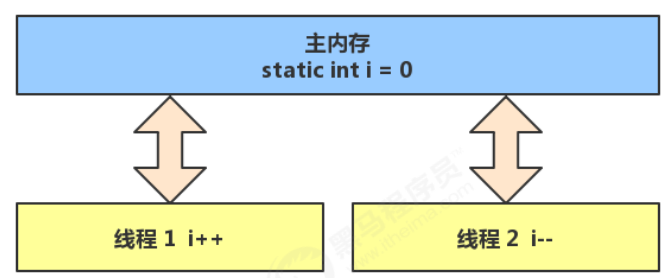

# 内存模型

## 1. Java内存模型

很多人将【java 内存结构】与【java 内存模型】傻傻分不清，【java 内存模型】是 Java MemoryModel（JMM）的意思。

关于它的权威解释，请参考 https://download.oracle.com/otn-pub/jcp/memory_model-1.0-pfd-spec-oth-JSpec/memory_model-1_0-pfd-spec.pdf?AuthParam=1562811549_4d4994cbd5b59d964cd2907ea22ca08b

简单的说，JMM 定义了一套在多线程读写共享数据时（成员变量、数组）时，对数据的可见性、有序性、和原子性的规则和保障。

Java内存模型，其实是保证了Java程序在各种平台下对内存的访问都能够得到一致效果的机制及规范。目的是解决由于多线程通过共享内存进行通信时，存在的原子性、可见性（缓存一致性）以及有序性问题。

简单总结下，Java的多线程之间是通过共享内存进行通信的，而由于采用共享内存进行通信，在通信过程中会存在一系列如可见性、原子性、顺序性等问题，而JMM就是围绕着多线程通信以及与其相关的一系列特性而建立的模型。JMM定义了一些语法集，这些语法集映射到Java语言中就是volatile、synchronized等关键字。

### 1.1 原子性

**什么是原子性？**

即一个操作或者多个操作要么全部执行并且执行的过程不会被任何因素打断，要么就都不执行。在Java中，只有对基本数据类型的变量的读取和赋值操作是原子性操作。如果要实现更大范围操作的原子性，可以通synchronized和Lock来实现（由于synchronized和Lock能够保证任一时刻只有一个线程执行该代码块）。

**问题讨论：**

两个线程对初始值为 0 的静态变量一个做自增，一个做自减，各做 5000 次，结果是 0 吗？

### 1.2 问题分析

以上的结果可能是正数、负数、零。为什么呢？因为 Java 中对静态变量的自增，自减并不是原子操作。

例如对于 i++ 而言（i 为静态变量），实际会产生如下的 JVM 字节码指令：

```java
getstatic i 		// 获取静态变量i的值
iconst_1 			// 准备常量1
iadd 				// 加法
putstatic i 		// 将修改后的值存入静态变量i
```

而对应 i-- 也是类似：

```java
getstatic i 		// 获取静态变量i的值
iconst_1 			// 准备常量1
isub 				// 减法
putstatic i 		// 将修改后的值存入静态变量i
```

而 Java 的内存模型如下，完成静态变量的自增，自减需要在主存和线程内存中进行数据交换：



如果是单线程以上 8 行代码是顺序执行（不会交错)没有问题：

```java
// 假设i的初始值为0
getstatic i 			// 线程1-获取静态变量i的值 线程内i=0
iconst_1 				// 线程1-准备常量1
iadd 					// 线程1-自增 线程内i=1
putstatic i 			// 线程1-将修改后的值存入静态变量i 静态变量i=1
getstatic i 			// 线程1-获取静态变量i的值 线程内i=1
iconst_1 				// 线程1-准备常量1
isub 					// 线程1-自减 线程内i=0
putstatic i 			// 线程1-将修改后的值存入静态变量i 静态变量i=0
```

但多线程下这 8 行代码可能交错运行（为什么会交错？思考一下）： 出现负数的情况：

```java
// 假设i的初始值为0
getstatic i 			// 线程1-获取静态变量i的值 线程内i=0
getstatic i 			// 线程2-获取静态变量i的值 线程内i=0
iconst_1 				// 线程1-准备常量1
iadd 					// 线程1-自增 线程内i=1
putstatic i 			// 线程1-将修改后的值存入静态变量i 静态变量i=1
iconst_1 				// 线程2-准备常量1
isub 					// 线程2-自减 线程内i=-1
putstatic i 			// 线程2-将修改后的值存入静态变量i 静态变量i=-1
```

出现正数的情况：

```java
// 假设i的初始值为0
getstatic i 			// 线程1-获取静态变量i的值 线程内i=0
getstatic i 			// 线程2-获取静态变量i的值 线程内i=0
iconst_1 				// 线程1-准备常量1
iadd 					// 线程1-自增 线程内i=1
iconst_1 				// 线程2-准备常量1
isub 					// 线程2-自减 线程内i=-1
putstatic i 			// 线程2-将修改后的值存入静态变量i 静态变量i=-1
putstatic i 			// 线程1-将修改后的值存入静态变量i 静态变量i=1
```

### 1.3 解决方法

使用synchronized （同步关键字），同步代码块。

语法：

```java
synchronized( 对象 ) {
    要作为原子操作代码
}
```

用 synchronized 解决并发问题：

```java
static int i = 0;
static Object obj = new Object();
public static void main(String[] args) throws InterruptedException {
    Thread t1 = new Thread(() -> {
        for (int j = 0; j < 5000; j++) {
            synchronized (obj) {
                i++;
            }
        }
    });
    Thread t2 = new Thread(() -> {
        for (int j = 0; j < 5000; j++) {
            synchronized (obj) {
                i--;
            }
        }
    });
    t1.start();
    t2.start();
    t1.join();
    t2.join();
    System.out.println(i);
}
```

如何理解呢：你可以把 obj 想象成一个房间，线程 t1，t2 想象成两个人。

当线程 t1 执行到 synchronized(obj) 时就好比 t1 进入了这个房间，并反手锁住了门，在门内执行count++ 代码。这时候如果 t2 也运行到了 synchronized(obj) 时，它发现门被锁住了，只能在门外等待。

当 t1 执行完 synchronized{} 块内的代码，这时候才会解开门上的锁，从 obj 房间出来。t2 线程这时才可以进入 obj 房间，反锁住门，执行它的 count-- 代码。

> 注意：上例中 t1 和 t2 线程必须用 synchronized 锁住同一个 obj 对象，如果 t1 锁住的是 m1 对象，t2 锁住的是 m2 对象，就好比两个人分别进入了两个不同的房间，没法起到同步的效果

## 2. 可见性

先来看一个现象，main 线程对 run 变量的修改对于 t 线程不可见，导致了 t 线程无法停止：

```java
static boolean run = true;
public static void main(String[] args) throws InterruptedException {
    Thread t = new Thread(()->{
        while(run){
            // ....
        }
    });
    t.start();
    Thread.sleep(1000);
    run = false; // 线程t不会如预想的停下来
}
```


可见性，它保证的是在多个线程之间，一个线程对 volatile 变量的修改对另一个线程可见， 不能保证原子性，**仅用在一个写线程，多个读线程的情况**： 上例从字节码理解是这样的：


如果在前面示例的死循环中加入 System.out.println() 会发现即使不加 volatile 修饰符，线程 t 也
能正确看到对 run 变量的修改了，想一想为什么？

因为printstream中使用synchronized代码块，它也能保证代码的可见性

